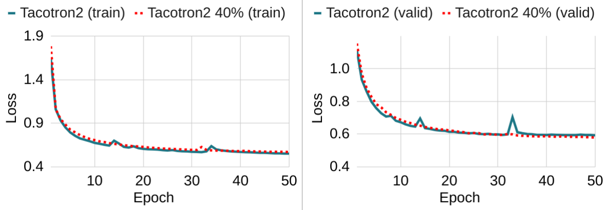
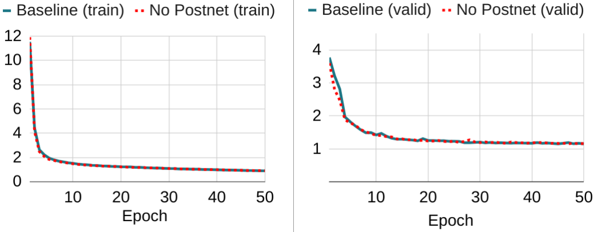
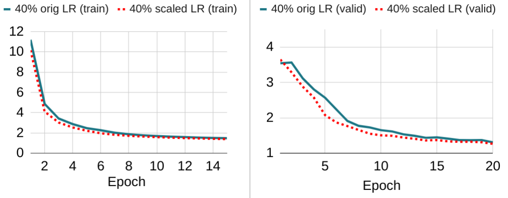
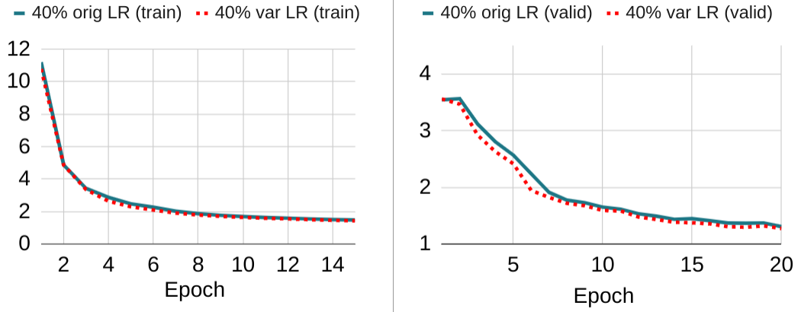
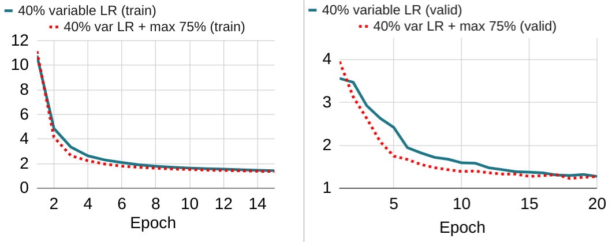

<div align="left"></div>

# SNIPER Training: Single-Shot Initialization Pruning Evolving-Rate Training


This repository contains the code for the paper "SNIPER TRAINING: VARIABLE SPARSITY RATE TRAINING FOR TEXT-TO-SPEECH" ([arXiv link](https://arxiv.org/abs/2211.07283)), submitted to ICASSP 2023.

To replicate my experiments, please install [Montreal Forced Aligner](https://github.com/MontrealCorpusTools/Montreal-Forced-Aligner) and follow the ESPnet installation instructions but on this repo. Use [this guide](https://github.com/espnet/espnet/issues/4521) for stage 1-5 of training, and for stage 6:

```
./run_mfa.sh --stage 6 --stop_stage 6     --train_config conf/tuning/train_fastspeech2_sniper40to0.yaml     --teacher_dumpdir data     --tts_stats_dir data/stats      --tts_exp exp/fastspeech2_40to0
```

I am in the middle of editing my pull request to integrate MFA into ESPnet, so it should be easier next time.

The audio samples used for listening experiments are [here](https://icassp2023.web.app/).

Additional figures mentioned in the paper, but which i did not have space to add, are:

Comparing Tacotron2 vs 40% sparse Tacotron2 on ESPnet:


Comparing FastSpeech2 with and without postnet (L1 loss for no-postnet model is doubled to ensure fair comparison):


Comparing no learning rate scaling vs scaling by 1/(1-sparsity):


Comparing global learning rate scaling vs scaling by parameter:


Comparing scaling by parameter without and with max sparsity limit:

