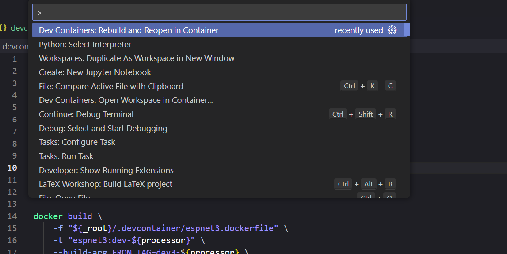
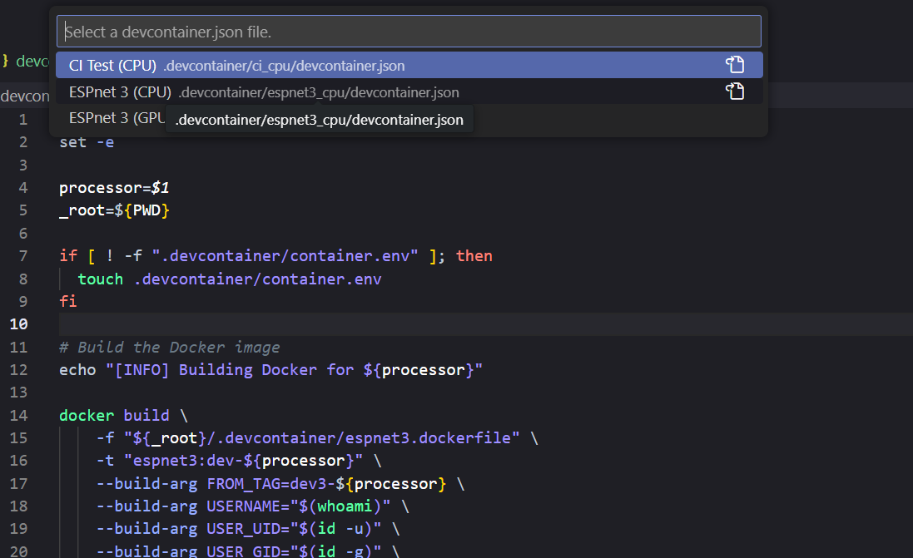

## Devcontainer

The **Visual Studio Code Dev Containers** (VSCode) extension lets you use a container as a full-featured development environment. It allows you to open any folder inside (or mounted into) a container and take advantage of Visual Studio Code's full feature set.
You can find detailed information about Dev Containers at https://code.visualstudio.com/docs/devcontainers/containers

### Implemented Dev Containers

You can find the availables dev containers at `.devcontainer`.
To launch the current working space in a dev container, first you need to have the `Dev Container` extension installed in VSCode.
You can launch the container from `F1` > `Dev Containers: Rebuild and Reopen Container`.

Select the preferred container from the displayed list:

This will build and launch the container automatically, with Python installed and the ESPnet package already installed.
You can launch tasks and edit the code without any issue.
