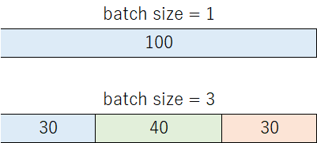

## ESPnet3: Collect Stats Phase Overview

In ESPnet2, there is a stage called "collect-stats" that precedes training. This stage serves two primary purposes:

1. **Collecting the lengths of acoustic features** to enable dynamic batch size adjustment.
2. **Computing the global mean and variance** of the acoustic features for normalization.

### 1. Feature Length Collection

By precomputing the lengths of acoustic feature sequences, ESPnet2 could dynamically adjust batch sizes during training. For instance, if the maximum number of frames per batch was set to 100, a batch might contain 1 long utterance or 3 short ones. This helped mitigate out-of-memory (OOM) issues on GPUs.



However, general-purpose trainers like PyTorch Lightning do not support such fine-grained batch control natively. In ESPnet3, this functionality is replaced by using **Lhotse**, which performs length analysis during dataset preparation. Lhotse enables dynamic batch sizing based on this metadata.

### 2. Global Mean and Variance (Global MVN)

ESPnet2 often used `GlobalMVN` for acoustic features. The statistics were computed over the entire dataset in the collect-stats stage and applied during training.
ESPnet3 relies on **[Lhotse](https://lhotse.readthedocs.io/en/latest/datasets.html#lhotse.dataset.signal_transforms.GlobalMVN)**, which supports computing mean and variance directly.
If a user already has `GlobalMVN` statistics from a prior ESPnet2 project, ESPnet3 allows specifying these via configuration so that models can continue to use them.

When you are using ESPnet models:
```yaml
normalize: global_mvn
normalize_conf:
  stats_file: train_feat_stats.npz
```

Or if you want to use `GloblMVN` on your custom model:
```yaml
normalize:
  _target_: espnet2.layers.global_mvn.GlobalMVN
  stats_file: /path/to/your/custom/stats_file.npz   
```


### 3. Advanced Use Cases: GPU-based Stats Collection

Some research projects may involve complex features, such as using HuBERT or other pretrained models for representation extraction. In such cases, feature extraction and stats computation may need to run on GPU.

ESPnet3 provides a parallelization API that supports GPU-based execution. By configuring the parallel execution settings to include GPUs, users can distribute GPU-heavy collect-stats jobs across workers.

parallel configuration:
```yaml
parallel:
  env: slurm
  n_workers: 8
  options:
    queue: gpu
    cores: 8
    processes: 1
    memory: 16GB
    walltime: 30:00
    job_extra_directives:
      - "--gres=gpu:1"
```

Python:
```python
from dask.distributed import get_worker, WorkerPlugin
from espnet3.parallel import (
    set_parallel, get_client, parallel_map
)

# Set parallel configuration
set_parallel(config.parallel)

# Initialize large instance for each worker
class LargeInstancePlugin(WorkerPlugin):
    def setup(self, worker):
        worker.dataset = load_dataset()
        worker.hubert = load_hubert()
        worker.hubert.to("cuda")

def collect_stats(idx):
    data = get_worker().dataset
    model = get_worker().hubert
    feat = model(data[idx]['audio']['array'])
    return feat

# Process
with get_client(LargeInstancePlugin()) as client:
    # Perform your collect-stats jobs here
    parallel_map(collect_stats, list(array(len(dataset))), client)

```


---

In summary, the collect-stats stage in ESPnet3 is largely replaced by Lhotse's native capabilities and parallel APIs. This simplifies the pipeline and integrates more naturally with general-purpose training frameworks like PyTorch Lightning.

