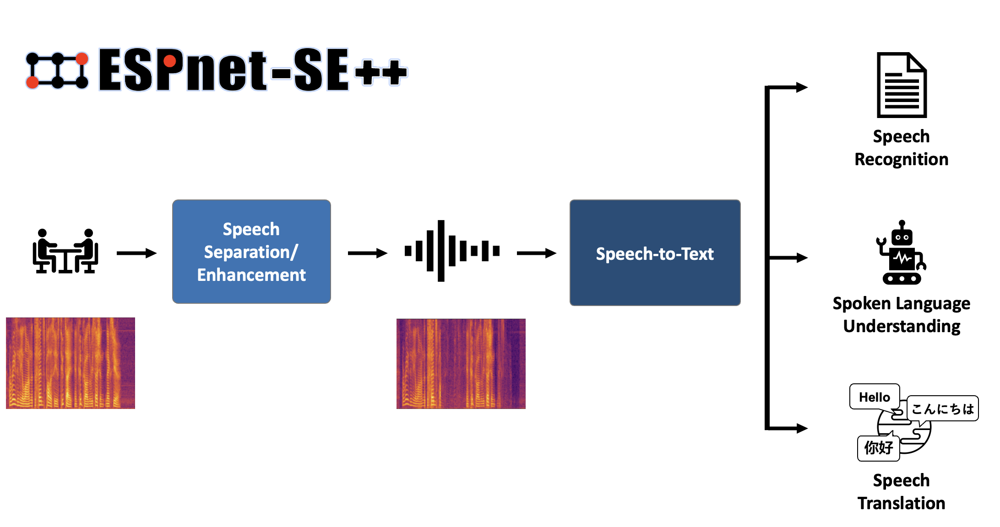
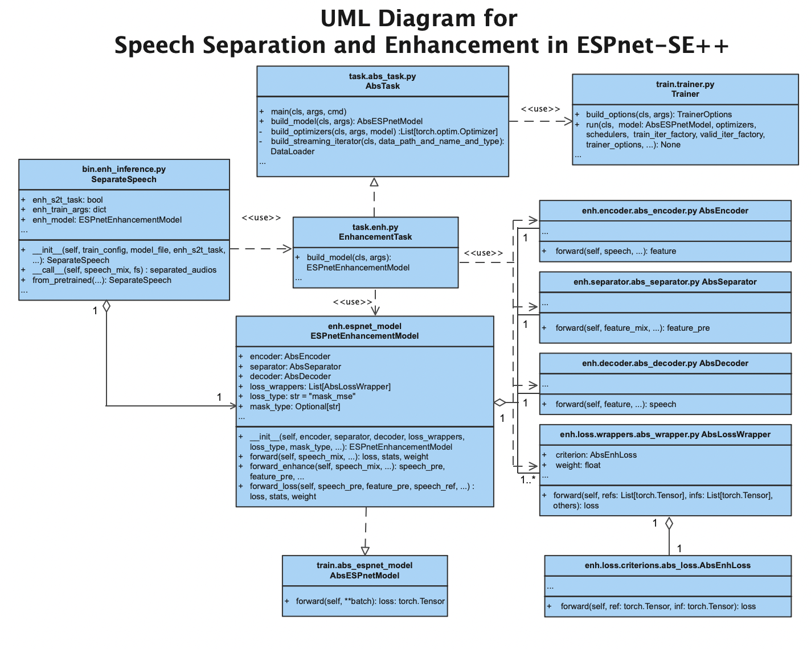
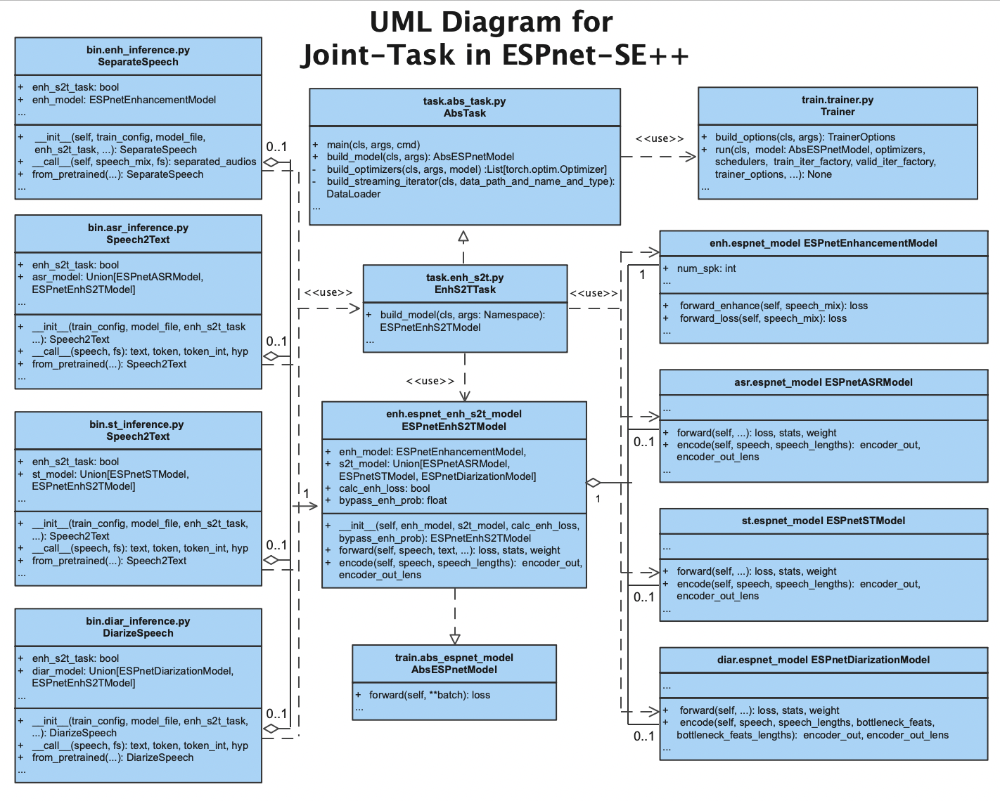

# Summary
This paper presents the software design and user interface of ESPnet-SE++, a new speech separation and enhancement (SSE) module of the ESPnet toolkit. 
ESPnet-SE++ expands significantly the functionality of ESPnet-SE [@Li:2021] with several new models, loss functions and recipes [@Lu:2022]. Crucially, it features a new, redesigned interface, which allows for a flexible combination of SSE front-ends with many downstream tasks, including automatic speech recognition (ASR), speaker diarization (SD), speech translation (ST), and spoken language understanding (SLU).

# Statement of need

[ESPnet](https://github.com/espnet/espnet) is an open-source toolkit for speech processing, including several ASR, text-to-speech (TTS) [@Hayashi:2020], ST [@Inaguma:2020], machine translation (MT), SLU [@Arora:2022], and SSE recipes [@Watanabe:2018]. Compared with other open-source SSE toolkits, such as Nussl [@Manilow:2018], Onssen [@Ni:2019], Asteroid [@Pariente:2020], and SpeechBrain [@Ravanelli:2021], the modularized design in ESPnet-SE++ allows for the joint combination of SSE modules with other tasks, such as SLU and ASR. Currently, ESPnet-SE++ supports 20 SSE recipes with 24 different enhancement/separation models. 


<!-- helps implement the joint-task modules of SSE. -->

# ESPnet-SE++ Recipes and Software Structure
ESPnet-SE++ is part of the ESPnet2 framework, and includes the recipes under the `egs2` folder and the modularized SSE and joint-task scripts and models under the `espnet2` folder. This section describes how these recipes and the ESPNet-SE++ modular codebase are structured. 

## ESPNet-SE++ Recipes for SSE and Joint-Task 

```text
espnet/
└── egs2/
    ├── chime4/
    │   ├── enh1/
    │   ├── enh_asr1/
    │   └── asr1/
    ├── l3das22/
    │   └── enh1/
    |   │   ├── conf/
    |   │   ├── local/
    |   |   │   ├── data.sh
    |   |   │   ├── metric.sh
    │   |   │   └── ...
    |   │   ├── enh.sh -> ../../TEMPLATE/enh1/enh.sh
    |   │   ├── run.sh
    |   │   └── ...
    ├── lt_slurp_spatialized/
    │   └── enh1/
    ├── slurp_spatialized/
    │   ├── enh_asr1/
    |   │   ├── enh_asr.sh -> ../../TEMPLATE/enh_asr1/enh_asr.sh
    |   │   ├── run.sh
    |   │   └── ...
    │   └── asr1/
    ├── ...
    └── TEMPLATE/
        ├── enh1/
        │   └── enh.sh
        ├── enh_asr1/
        │   └── enh_asr.sh
        ├── enh_diar1/
        │   └── enh_diar.sh
        ├── enh_st1/
        │   └── enh_st.sh
        └── ...
```

For each task, ESPnet-SE++, following ESPnet2 style, provides common scripts which are carefully designed to work out-of-the-box with a wide variety of corpora. Under the `TEMPLATE` folder, the common scripts `enh1/enh.sh` and `enh_asr1/enh_asr.sh` are shared for all the SSE and joint-task recipes. Symbolic links to the shared scripts are created under each `enh1` and `enh_asr1` corpus folders and called by their `run.sh`. 

### Common Scripts
`enh.sh` contains 13 stages, and the details for the scripts can be found in [TEMPLATE/enh1/README.md](https://github.com/espnet/espnet/blob/master/egs2/TEMPLATE/enh1/README.md). 

- stage 1 to stage 4: data preparation stages

    - stage 1: Call the local/data.sh script from the recipe to generate Kaldi-style data [@Povey:2011] directories for each subset.
    - stage 2: Optional offline augmentation of input dataset (e.g. speed perturbation).
    - stage 3: Create a temporary data dump folder, segment audio files, and change the audio format and sampling rate if needed. This step normalizes the general format of audio files, and thus enables to combine  different corpora at training or inference time.
    - stage 4: Possibly remove too short and too long utterances
    
- stage 5 to stage 6: SSE training steps

    - stage 5: Collect dataset statistics which can be used to sort examples for dataloading purposes or for normalization

    - stage 6: SSE task training 

- stage 7 to stage 8: Evaluation stages: inferencing and storing the enhanced audios (stage 7), and scoring (stage 8)

- stage 9 to stage 10: Evaluation stages for speech recognition or understanding: decoding with a pretrained ASR/SLU model (stage 9) and scoring with a pretrained ASR model
 (stage 10)


- stage 11 to stage 13: model uploading steps, upload the trained model to Zenodo or Hugging Face through these three final steps.


`enh_asr.sh` contains 17 stages and `enh_diar.sh` and `enh_st.sh` are similar to it:


- stage 1 to stage 5: data preparation stages

- stage 6 to stage 9: language model training steps

- stage 10 to stage 11: joint-task training steps

- stage 12 to stage 13: Inference stages: Decoding (stage 12), and enhancing (stage 13)

- stage 14 to stage 15:  Scoring recognition results (stage 14) and SSE results (stage 15)

- stage 16 to stage 17: model uploading steps, upload the trained model through the final steps.

<!-- ## Software Structure for SSE and Joint-task -->

### Training Configuration
After the data preparation stages of `enh.sh`  and `enh_asr.sh`, the training and inference stages call the SSE and joint-task interfaces under `espnet2` according to the training configuration in the `conf` folder. 

#### SSE Task Training Configuration
An example of an enhancement task for the CHiME-4 `enh1`  recipe is configured as [`conf/tuning/train_enh_dprnn_tasnet.yaml`](https://github.com/espnet/espnet/blob/master/egs2/chime4/enh1/conf/tuning/train_enh_dprnn_tasnet.yaml). Part of this configuration is: 


    encoder: conv
    encoder_conf:
        channel: 64
        kernel_size: 2
        stride: 1
    decoder: conv
    decoder_conf:
        channel: 64
        kernel_size: 2
        stride: 1
    separator: dprnn
    separator_conf:
        num_spk: 1
        layer: 6
        rnn_type: lstm
        bidirectional: True  # this is for the inter-block rnn
        nonlinear: relu
        unit: 128
        segment_size: 250
        dropout: 0.1
        nonlinear: relu

    criterions: 
      # The first criterion
      - name: si_snr 
        conf:
          eps: 1.0e-7
        # the wrapper for the current criterion
        # for single-talker case, we simplely use fixed_order wrapper
        wrapper: fixed_order
        wrapper_conf:
          weight: 1.0

The training configuration describes a single-channel speech enhancement task with a DPRNN [@Luo:2020] model based on a convolutional encoder-masker-decoder framework, popularized by TasNet [@Luo:2018] and Conv-Tasnet [@Luo:2019]. In addition, loss-related modules, wrapper and criterion, are specified. The remaining configurations describe the training strategy and the optimizer configuration.

<!-- the network structure of all the submodules of the SSE module,  -->

#### Joint-Task Training Configuration
An example of joint-task training configuration is the CHiME-4 `enh_asr1` recipe, configured as [`conf/tuning/train_enh_asr_convtasnet.yaml`](https://github.com/espnet/espnet/blob/master/egs2/chime4/enh_asr1/conf/tuning/train_enh_asr_convtasnet_si_snr_fbank_transformer_lr2e-3_accum2_warmup20k_specaug.yaml). This joint-task includes a front-end enhancmenet model and a back-end ASR model: 

    # network architecture
    enh_encoder: conv
    enh_encoder_conf:
        channel: 256
        kernel_size: 40
        stride: 20
    enh_decoder: conv
    enh_decoder_conf:
        channel: 256
        kernel_size: 40
        stride: 20
    enh_separator: tcn
    enh_separator_conf:
        num_spk: 1
        layer: 4
        stack: 2
        bottleneck_dim: 256
        hidden_dim: 512
        kernel: 3
        causal: False
        norm_type: "gLN"
        nonlinear: relu
    enh_criterions:
      # The first criterion
      - name: si_snr
        conf:
            eps: 1.0e-7
        # the wrapper for the current criterion
        # for single-talker case, we simplely use fixed_order wrapper
        wrapper: fixed_order
        wrapper_conf:
            weight: 1.0

    frontend: default
    frontend_conf:
        fs: 16000
        n_fft: 512
        win_length: 400
        hop_length: 160
        frontend_conf: null
        apply_stft: True

    # encoder related
    asr_encoder: transformer
    asr_encoder_conf:
        output_size: 256
        attention_heads: 4
        linear_units: 2048
        num_blocks: 12
        dropout_rate: 0.1
        attention_dropout_rate: 0.0
        input_layer: conv2d
        normalize_before: true

    # decoder related
    asr_decoder: transformer
    asr_decoder_conf:
        input_layer: embed
        attention_heads: 4
        linear_units: 2048
        num_blocks: 6
        dropout_rate: 0.1
        positional_dropout_rate: 0.0
        self_attention_dropout_rate: 0.0
        src_attention_dropout_rate: 0.0

    asr_model_conf:
        ctc_weight: 0.3
        lsm_weight: 0.1
        length_normalized_loss: false
        extract_feats_in_collect_stats: false

    model_conf:
        bypass_enh_prob: 0.0

For the configuration of the front-end SSE model, the joint task configuration describes a network structure identical to that of a single SSE task, including encoder, decoder, separator, wrapper, and criterion. On the other hand, the back-end ASR model also has configurations for its encoder and decoder. To avoid name confusion, the prefix `enh_` is added to the submodules of SSE and the prefix `asr_` is added to the submodules of ASR.


<!-- Similar to the SSE configuration, the joint-task configuration describes the network architecture for the SSE and ASR modules.  -->

The following section describes the interfaces, control classes, and modules of the SSE and joint-task models.


## ESPNet-SE++ Software Structure for SSE Task

```text
espnet/
└── espnet2/
    ├── bin/
    │   ├── enh_train.py
    │   ├── enh_inference.py
    │   ├── enh_scoring.py
    │   └── ...
    ├── enh/
    │   ├── decoder/
    │   ├── encoder/
    │   ├── layers/
    │   ├── loss/
    │   │	├── criterions
    │   │	└── wrappers
    │   ├── separator/
    │   ├── espnet_model.py
    │   └── ...
    ├── tasks/
    │   ├── abs_task.py
    │   ├── enh.py
    │   └── ...
    ├── train/
    │   ├── abs_espnet_model.py
    │   ├── trainer.py
    │   └── ...
    └── ...
```


###  Unified Modeling Language Diagram for ESPNet-SE++ Enhancement-Only Task
The code flow of ESPNet-SE++ for SSE task training and inference can be visualized in the following diagram.




### SSE Executable Code `bin/`
The design of the SSE executable code follows the same high level design and interface of the others ESPNet tasks (e.g. ASR, SLU et cetera). In addition, ESPnet-SE++ has its own scoring method for calculating several popular objective scores for the enhanced/separared speech such as SI-SDR [@le:2019], STOI [@Taal:2011], SDR and PESQ [@Rix:2001].


#### bin.enh_train.py
 As the main interface for the SSE training stage of `enh.sh`, `enh_train.py` takes the training parameters and model configurations from the arguments and calls
<!--  scripts and calls  -->

	EnhancementTask.main(...) 

to build an SSE object `ESPnetEnhancementModel`, which is used to train the SSE model according to the model configuration.. 

The training procedure is controlled by the general training class `Trainer` under `train.trainer` . After training, `enh_train.py` saves the SSE model checkpoint and configuration.


#### bin.enh_inference.py
As the main interface for the SSE inferencing stage of `enh.sh`, `enh_inference.py` has  

	class SeparateSpeech
which builds an SSE object `ESPnetEnhancementModel` through the `EnhancementTask.build_model` class method based on a pair of configuration and a pre-trained SSE model.

Calling the `SeparateSpeech` object with an unprocessed audio returns a list of separated speech, where the length is the same as the number of speakers. The audio is enhanced by calling the `encoder`,  `separator`, and `decoder` classes in the SSE model.

The `inference` function in `enh_inference.py` contains the full inference process, which builds and calls a `SeparateSpeech` object with the data-iterator for testing and validation data.


#### bin.enh_scoring.py
The SSE scoring functions currently support calculating multiple objective scores, including STOI, ESTOI, SI-SNR, SDR, SIR, and SAR scores. These scores are calculated based on the reference signal and processed speech pairs:

	def scoring(output_dir,...,ref_scp, inf_scp, ...)

The scoring function also provides a summary of the scores throurough the test dataset for the SSE scoring stage of `enh.sh`. 
<!-- calculates and writes scores for each utterance pair in the `ref_scp` and `inf_scp` to the output directory.  -->


### SSE Control Class `tasks/`

#### tasks.enh.py

	class EnhancementTask(AbsTask)
`EnhancementTask` is a control class which is designed for SSE task, containing class methods for building and training an SSE model, including `preprocessor`, `data_loader`, and `collate_fn`. Class method  `build_model` creates and returns an SSE object from

    enh.espnet_model.ESPnetEnhancementModel


### SSE Modules `enh/`
#### enh.espnet_model.py

	class ESPnetEnhancementModel(AbsESPnetModel)
    
`ESPnetEnhancementModel` is the base class for any ESPnet-SE++ SSE model. It consists of `encoder`, `decoder`, `separator`, `criterion`, and `wrapper`. Since the `ESPnetEnhancementModel` inherits the same abstract base class `AbsESPnetModel`, it is well-aligned with other tasks such as ASR, TTS, ST, and SLU, bringing the benefits of cross-tasks combination. The forward functions of the class include three diffeent interfaces where the first one
	 
	 def  forward(self, speech_mix, speech_ref, ...)

`forward` follows the general design in the ESPnet single-task modules, which processes speech and only returns losses for the trainer to update the model. However, enhanced speech is necessary for joint-task training. The forward function is further divided into two sub-functions for more flexible combinations:

	 def  forward_enhance(self, speech_mix, ...)
	 def  forward_loss(self, speech_pre, speech_ref, ...)

The `forward_enhance` function returns the enhanced speech, and the `forward_loss` function returns the loss. The joint-training methods take the enhanced speech as the input for the downstream task and the SSE loss as a part of the joint-training loss.


#### encoder, separator, and decoder 
The SSE model contains three submodules: encoder, separator, and decoder. Encoder and decoder options include short-time Fourier transform (STFT) and inverse STFT (iSTFT) for the time-frequency (TF) domain models, and convolutional layers and transposed convolutional layers for time domain models. 

The separator is a sequence mapping neural network, which takes the input from the encoder and generates separated output features. The number of separated features is the same as the number of the speech sources, and for most SSE models, separator only has one output feature. Finally, the decoder transforms the features into the target audios.

This modular design allows for the exploration of many different architectural variations with less complicated code. The same separator can be used with different encoders/decoders (e.g., SSL/Freq domain)

#### criterion and wrapper
The criterion is an implementation of loss functions, including time domain criteria and TF domain criteria. The time domain criteria take the estimated audio and target audio as input, and the TF domain criteria take the estimated feature and the encoded features of target audio as input. The output of the criterion is a scalar loss value.

Instead of calculating the loss by directly passing all the separated features and references into the criterion, `ESPnetEnhancementModel` calculates the loss through the wrapper combined with a criterion. For example, the Permutation invariant training (PIT) [@Yu:2017] algorithm is designed as `class PITSolver(AbsLossWrapper)` with the procedure to find the best permutation. This modular design allows researchers to design custom wrapper classes for implementing complicated training objectives conveniently.


## ESPNet-SE++ Software Structure for Joint-Task 

```text
espnet/
└── espnet2/
    ├── bin/
    │   ├── asr_inference.py
    │   ├── diar_inference.py
    │   ├── enh_s2t_train.py
    │   ├── st_inference.py
    │   └── ...
    ├── enh/
    │   ├── espnet_enh_s2t_model.py
    │   └── ...
    ├── tasks/
    │   ├── enh_s2t.py
    │   └── ...
    └── ...
    
```
The design of the joint-task code follows the same design as SSE and other tasks, where the `enh_s2t` stands for the joint-task of SSE and a downstream speech-to-text (s2t) task, including automatic speech recognition (ASR), spoken language understanding (SLU), speech translation (ST), and speaker diarization (SD) tasks.


### Unified Modeling Language Diagram for ESPNet-SE++ Joint-Task
The code flow of ESPNet-SE++ for joint-task training and inference can be visualized as the following diagram.




### Joint-Task Executable Code `bin/`
Executable scripts for joint-task include training and inferencing code. Currently, joint-task does not have their task-specific methods. 

#### bin.enh_s2t_train.py
Similar to the interface of SSE training code `enh_train.py`, `enh_s2t_train.py` takes the training parameters and modular parameters from the training stage of the joint-task scripts, and calls  

	tasks.enh_s2t.EnhS2TTask.main(...) 

to build a joint-task object for training the joint model based on a configuration with both SSE and speech-to-text models information with or without pre-trained checkpoints. After training, instead of saving two models separately, `enh_s2t_train.py` saves a joint-task checkpoint and configuration for the `enh_s2t` task.


#### bin.asr_inference.py, bin.diar_inference.py, and bin.st_inference.py

As the interface for the downstream speech-to-text decoding stage of the joint-task scripts, `asr_inference.py`, `st_inference.py` and `diar_inference.py` have  

	class Speech2Text
    class DiarizeSpeech

to process speech for each task. During their initialization, the classes can build a back-end model object through their own back-end task classes or a joint-task object `ESPnetEnhS2TModel` through the `EnhS2TTask.build_model` class method with pre-trained joint-task models and configurations. 


Calling the `SeparateSpeech` or `DiarizeSpeech` objects with an unprocessed audio returns a list of text results and tokens. The audio is enhanced and recognized by calling the `encode` function and `decode`or `beam_search` functions, where the `encode` function applies both the front-end SSE model and the encoder of the back-end model.

The `inference` function in `asr_inference.py`, `diar_inference.py`, and `st_inference.py` contains the full inference processes, which build and call a `SeparateSpeech` object or `DiarizeSpeech` object with the data-iterator for testing and validation.


#### bin.enh_inference.py
As introduced in the SSE task section, `enh_inference.py` has `SeparateSpeech` object with an SSE object attribute `ESPnetEnhancementModel`. The `ESPnetEnhancementModel` object can be created through both `EnhancementTask.build_model` and `EnhS2TTask.build_model` class methods for the enhancing stage of the joint-task scripts. 


### Joint-task Control Class `tasks/`

#### tasks.enh_s2t.py

	class EnhS2TTask(AbsTask)
    
`class EnhS2TTask` is designed for joint-task with an SSE model front-end and a back-end subtask model. Class method `build_model` creates a front-end and a back-end subtask models based on the `subtask_series` argument. The subtask models are then sent into the `__init__` function from 

    enh.espnet_enh_s2t_model.ESPnetEnhS2TModel

to create and return an joint-task object. 

### Joint-Task Modules `enh/`

#### enh.espnet_enh_s2t_model.py

	class ESPnetEnhS2TModel(AbsESPnetModel)

Like `ESPnetEnhancementModel`, `ESPnetEnhS2TModel` inherits the abstract base class `AbsESPnetModel` and has the same interface as other tasks. The consistent modularized design enables the models in various tasks to be combined easily. In addition, the pre-trained checkpoints for different modules can be loaded into the joint model. 

The `__init__` function takes an `enh_model`, and an `s2t_model` as inputs to build a joint model containing both front-end and back-end models.

	def __init__(
	    self,
	    enh_model: ESPnetEnhancementModel,
	    s2t_model: Union[ESPnetASRModel, ESPnetSTModel, ESPnetDiarizationModel],, 
	    ...
	):
	

The front-end model currently should be an SE model, and the back-end model could be ASR, SLU, ST, and SD models.

The `forward` function of the class follows the general design in ESPnet2 single-task modules:
	 
	 def  forward(self, speech_mix, speech_ref, ...)

which processes speech and only returns losses for `Trainer` to update the model. 


# ESPnet-SE++ User Interface

## Building a New Recipe from Scratch
Since ESPnet2 provides common scripts such as `enh.sh` and `enh_asr.sh` for each task, given a new corpus ideally users would only need to create `local/data.sh` for the data preparation.
<!-- ideally users would only need to create `local/data.sh` for the data preparation of the corpus. -->

<!-- adding a recipe for new corpus  , users can train models with their corpus without modifying the recipes. -->

### Prepare the data : local/data.sh

The data for each recipe is created by their own `local/data.sh`. The generated data follows the Kaldi-style structure:

```text
enh_asr1/
└── data/
    ├── train/
    │   ├── text      
    │   ├── spk1.scp
    │   ├── wav.scp  
    │   ├── utt2spk  
    │   ├── spk2utt  
    │   └── segments 
    ├── dev/
    └── test/
```

- `text`: The transcription for each utterance (Optional for the SSE task).
- `spk1.scp`: Wave file path to the clean utterances.
- `wav.scp`: Wave file path to the noisy utterances.
- `utt2spk`: Mapping utterance-id to speaker-id.
- `spk2utt`: Mapping speaker-id to utterance-id.
- `segments`: Specifying the start and end time of each utterance (Optional).

Since the tasks share the same data pre-processing format, the data can be easily used for different tasks. The detailed instructions for data preparation and building new recipes in espnet2 are described in the following link:
<!-- 
1. https://github.com/shinjiwlab/lab_activities/wiki/How-to-make-a-ESPnet2-recipe-from-scratch -->

https://github.com/espnet/espnet/tree/master/egs2/TEMPLATE


###  Scoring metrics for challenges and benchmarks (optional)
Some of the challenges and datasets have their own metric calculation. The recipe-specific scoring scripts are prepared under the local/ directory of each recipe (if needed).

Example of the L3DAS22 Challenge:

	Usage: local/metric.sh <predicted scp> <target scp>
	
	>>> local/metric.sh exp/enh_train_enh_ineube_raw/enhanced_test_multich/spk1.scp dump/raw/test_multich/spk1.scp
	
	word error rate: 4.85
	stoi: 0.957
	task 1 metric: 0.954
	

##  Inference with Pre-trained Models
Pretrained models from ESPnet are provided on HuggingFace and Zenodo. Users can download and infer with the models.`model_name` in the following section should be `huggingface_id` or one of the tags in the [table.csv](https://github.com/espnet/espnet_model_zoo/blob/master/espnet_model_zoo/table.csv) in [espnet_model_zoo](https://github.com/espnet/espnet_model_zoo) . User can also directly provide a Zenodo URL or a HuggingFace URL.


### Inference API
The inference functions are from the `enh_inference` and `enh_asr_inference` in the executable code `bin/`

    from espnet2.bin.enh_inference import SeparateSpeech
    from espnet2.bin.enh_asr_inference import Speech2Text

As described in the previous section, calling `SeparateSpeech` and `Speech2Text` with unprocessed audios returns the separated speech and their recognition results. 

#### SSE 

    import soundfile
    from espnet2.bin.enh_inference import SeparateSpeech
    separate_speech = SeparateSpeech.from_pretrained(
        "model_name",
        # load model from enh model or enh_s2t model
        enh_s2t_task=True,
        # for segment-wise process on long speech
        segment_size=2.4,
        hop_size=0.8,
        normalize_segment_scale=False,
        show_progressbar=True,
        ref_channel=None,
        normalize_output_wav=True,
    )
    # Confirm the sampling rate is equal to that of the training corpus.
    # If not, you need to resample the audio data before inputting to speech2text
    speech, rate = soundfile.read("long_speech.wav")
    waves = separate_speech(speech[None, ...], fs=rate)
 

This API allows the processing of both short audio samples and long audio samples. For long audio samples, you can set the value of arguments `segment_size`, `hop_size` (optionally `normalize_segment_scale` and `show_progressbar`) to perform segment-wise speech enhancement/separation on the input speech. Note that the segment-wise processing is disabled by default.

#### Joint-Task

    import soundfile
    from espnet2.bin.asr_inference import Speech2Text
    speech2text = Speech2Text.from_pretrained(
        "model_name",
        # load model from enh_s2t model
        enh_s2t_task=True,
        # Decoding parameters are not included in the model file
        maxlenratio=0.0,
        minlenratio=0.0,
        beam_size=20,
        ctc_weight=0.3,
        lm_weight=0.5,
        penalty=0.0,
        nbest=1
    )
    # Confirm the sampling rate is equal to that of the training corpus.
    # If not, you need to resample the audio data before inputting to speech2text
    speech, rate = soundfile.read("speech.wav")
    nbests, waves = speech2text(speech)

    text, *_ = nbests[0]
    print(text)
The details for downloading models and inference are described in the following link: https://github.com/espnet/espnet_model_zoo


# Demonstrations
The demonstrations of ESPnet-SE can be found in the following google colab links:

- [ESPnet SSE Demonstration: CHiME-4 and WSJ0-2mix](https://colab.research.google.com/drive/1fjRJCh96SoYLZPRxsjF9VDv4Q2VoIckI?usp=sharing) 
- [ESPnet-SE++ Joint-Task Demonstration: L3DAS22 Challenge and SLURP-Spatialized](https://colab.research.google.com/drive/1hAR5hp8i0cBIMeku8LbGXseBBaF2gEyO#scrollTo=0kIjHfagi4T1)


# Development plan
The development plan of the ESPnet-SE++ can be found in https://github.com/espnet/espnet/issues/2200. In addition, the current joint-task design for the front-end task needs to be speech-to-speech transformation, and the back-end task needs to take speech as input to generate recognition, understanding, or translation results. In the future, we would like to extend to other type of combinations, such as using ASR as a front-end model and TTS as a back-end model to create a speech-to-speech conversion, making the selection of front-end and back-end modules more flexible. 

<!-- the TTS module is unavailable within the current structure.  -->

# Conclusions
In this paper, we introduce the software structure and the user interface of ESPnet-SE++, including the SSE task and joint-task models. ESPnet-SE++ provides the general recipes for training models on different corpus and a simple way for adding new recipes. The joint-task implementation further shows that the modularized design improves the flexibility of ESPnet.


# References
