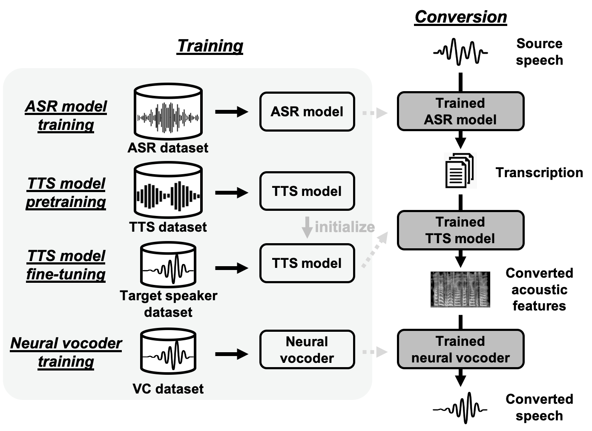

# Recipe for Voice Conversion Challenge 2020 baseline: Cascade ASR + TTS

Official homepage: [http://www.vc-challenge.org/](http://www.vc-challenge.org/)

**Update (2020/12)**: With the [release of the official dataset](https://github.com/nii-yamagishilab/VCC2020-database), we updated this recipe so that the dataset can now be automatically downloaded. Also, we provided evaluation scripts to calculate MCD (mel-cepstrum distortion), CER (character error rate) and WER (word error rate) of the test set.

## Introduction

This recipe describes a baseline for the Voice Conversion (VC) Challenge 2020 (VCC2020 for short). VCC2020 contains two tasks. In either task, the source speaker is always native English and the source speech is always  English. Task 1 requires to convert to a English target speaker with a small amount of English parallel training set, and task 2 requires to convert to a non-English (German/Finnish/Mandarin) target speaker with a non-English training set. Task 2 is also referred to as cross-lingual VC.

## Method and flow

A naive approach for VC is a cascade of an automatic speech recognition (ASR) model and a text-to-speech (TTS) model. In this recipe, we revisit this method under an end-to-end (E2E) framework.



- Specifically, we train a (speaker-independent) ASR model, and a separate speaker-dependent TTS model for each target speaker. First, the ASR model takes the source English speech as input and output the transcribed text. Then, the TTS model of the target speaker synthesizes the converted speech using the recognition result.
- Since the size of the training set of each target speaker is too limited for E2E TTS learning, we use a pretraining-finetuning scheme to improve the performance.
- Neural waveform generation modules (vocoders) has brought significant improvement to VC in recent years. In this baseline, we adopt the open-source [Parallel WaveGAN](https://github.com/kan-bayashi/ParallelWaveGAN) (PWG), since it enables high-quality, faster-than-real-time acoustic feature to waveform decoding.

The training flow is as follows:

1. ASR training. A [Transformer-based ASR model](https://github.com/espnet/espnet/tree/master/egs/librispeech/asr1) is used. ESPnet provides a state-of-the-art [LibriSpeech pretrained model](https://github.com/espnet/espnet/blob/master/egs/librispeech/asr1/RESULTS.md#pytorch-large-transformer-with-specaug-4-gpus--large-lstm-lm), which is already good enough (WER ~ 3/5 % on LibriSpeech dev/test set) so we did not include ASR training in our recipe. If you want to further refine the ASR pretrained model, please revisit our Librispeech recipe or other ASR recipes in ESPnet.
2. TTS pretraining. We use a [multi-speaker, x-vector Transformer-TTS model](https://github.com/espnet/espnet/tree/master/egs/libritts/tts1). In task 1, we use the [Libritts pretrained model](https://github.com/espnet/espnet/blob/master/egs/libritts/tts1/RESULTS.md#v050-first-multi-speaker-transformer-1024-pt-window--256-pt-shift--x-vector-with-add-integration--fast-gl-64-iters) provided by ESPnet. In task 2, corpora of two languages are used for pretraining: English and the language of the target speaker.
3. TTS finetuning. We update all parameters using the training set of the target speaker.
4. PWG training. We pool the training data from all available speakers in each task.

## Recipe structure

- `tts1_en_[de/fi/zh]`: TTS pretraining using English and the non-English language (de:German; fi:Finnish; zh:Mandarin).
- `voc1`: PWG training.
- `vc1_task[1/2]`: TTS finetuning, and the conversion phase for task 1 and task 2.

## Requirements

The following packages do not come with the installation of ESPnet. Please install them via `pip`.

```
cd <recipe>
. ./path.sh
pip install -U pypinyin parallel-wavegan
```

- [pypinyin](https://pypi.org/project/pypinyin/): used in `tts1_en_zh` and `vc1_task2`.
- [parallel-wavegan](https://pypi.org/project/parallel-wavegan/): used in `voc1`, `vc1_task1` and `vc1_task2`.

## Datasets and preparation.

The following datasets are used to train this baseline method.

- **LibriSpeech** contains English data for ASR training. It can be downloaded automatically in the recipe.
- **LibriTTS** contains English data for task 1 TTS pretraining. It can be downloaded automatically in the recipe.
- **M-AILABS** contains English and German data for task 2 TTS pretraining. It can be downloaded automatically in the recipe.
- **[CSS10](https://www.kaggle.com/bryanpark/finnish-single-speaker-speech-dataset)** contains Finnish data for task2 TTS pretraining. To download this dataset, Kaggle membership is required. Please download and put it in the desired directory. (default is `tts_en_fi/downloads/`)
- **CSMSC** contains Mandarin data for task 2 TTS pretraining. It can be downloaded automatically in the recipe.
- **VCC2020** contains the main training data of the challenge. It can be downloaded automatically in the recipe.

## Usage

To speed up experiments and development, we provide pretrained models for the `tts1*` and `voc1` recipes. So, users can skip `tts1*` and `voc1` recipes, and run `vc1_task[1/2]` directly. The pretrained model will be downloaded automatically in `vc1_task[1/2]`. In other words, users may run only the fine-tuning recipes.

For detailed usage, please see the readme in each recipe.

## Converted samples

We provide two sets of converted samples as reference:

1. Since the training set of the source English speakers (Numbers `E10001` to `E10060`) is not used in this baseline method, we use it as the development set. You can find the converted samples [here](https://drive.google.com/drive/folders/1oeZo83GrOgtqxGwF7KagzIrfjr8X59Ue?usp=sharing).

1. The organizers prepared another reference set (Numbers `E20001` to `E20020`). You can find the converted samples [here](https://drive.google.com/drive/folders/1C2BlumRiSNPsOCHgJNZVhpCbOXlBTT1w?usp=sharing).

## Citations

If you use this recipe for your research, please kindly cite the following papers:

```
@inproceedings{Yi2020,
    author={Zhao Yi and Wen-Chin Huang and Xiaohai Tian and Junichi Yamagishi and Rohan Kumar Das and Tomi Kinnunen and Zhen-Hua Ling and Tomoki Toda},
    title={{Voice Conversion Challenge 2020 –- Intra-lingual semi-parallel and cross-lingual voice conversion –-}},
    year=2020,
    booktitle={Proc. Joint Workshop for the Blizzard Challenge and Voice Conversion Challenge 2020},
    pages={80--98},
    doi={10.21437/VCC_BC.2020-14},
    url={http://dx.doi.org/10.21437/VCC_BC.2020-14}
}

@inproceedings{Huang2020,
    author={Wen-Chin Huang and Tomoki Hayashi and Shinji Watanabe and Tomoki Toda},
    title={{The Sequence-to-Sequence Baseline for the Voice Conversion Challenge 2020: Cascading ASR and TTS}},
    year=2020,
    booktitle={Proc. Joint Workshop for the Blizzard Challenge and Voice Conversion Challenge 2020},
    pages={160--164},
    doi={10.21437/VCC_BC.2020-24},
    url={http://dx.doi.org/10.21437/VCC_BC.2020-24}
}
```

## Author

Main development: Wen-Chin Huang @ Nagoya University (2020/03)
Advisors: Tomoki Hayashi (Nagoya U), Shinji Watanabe (JHU), Tomoki Toda (Nagoya U)
Special thanks: Matthew Wiesner (JHU)
If you have any questions, please open an issue.
Or contact through email: wen.chinhuang@g.sp.m.is.nagoya-u.ac.jp
