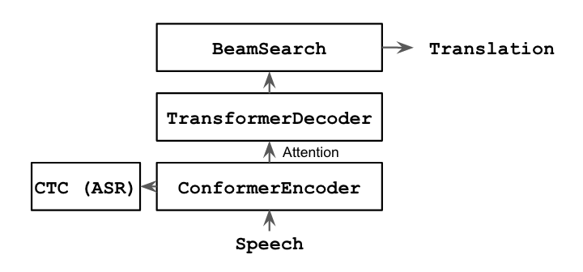
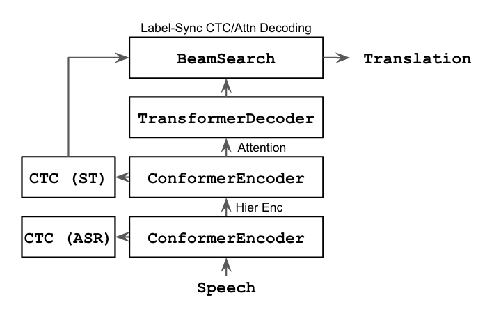
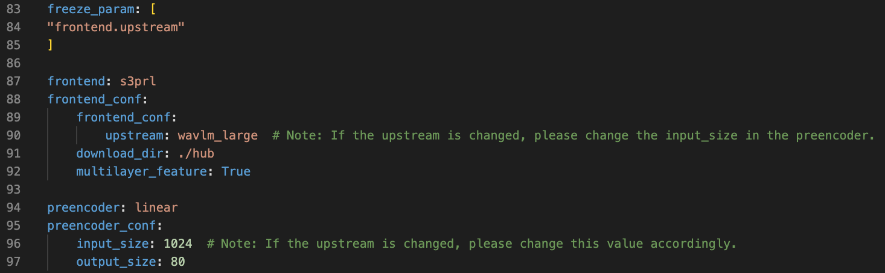

# ESPnet-ST-v2: Speech-to-Text Translation

!!This page is under construction!!

Documentation for the ESPnet-ST-v2 project, to be presented at ACL 2023. This branch will be merged to the ESPnet master. More details can be found [here](https://arxiv.org/pdf/2304.04596v1.pdf).

To use this development version, please clone this branch and then proceed with the normal [ESPnet2 installation](https://espnet.github.io/espnet/installation.html) (Kaldi is not required):

`git clone https://github.com/brianyan918/espnet-ml.git`

`git checkout md_pr`

## Table of Contents
* Results
   * Offline ST
   * Simultaneous ST
* Offline ST Models
   * Core Architectures
      * Attentional Encoder-Decoder
      * CTC/Attention
      * Transducer
      * Multi-Decoder
   * Auxiliary Techniques
      * ASR Pre-training
      * SSL Front-end/Encoder
      * LLM Decoder
      * Hierarchical Encoding
      * Minimum Bayes-Risk Decoding
* Streaming ST Models
   * Core Architectures
      * Blockwise CTC/Attention
      * Label-Synchronous Blockwise CTC/Attention
      * Time-Synchronous Blockwise CTC/Attention
      * Blockwise Transducer
   * Auxiliary Techniques
      * Using an offline model for streaming inference
* Code Components
* How to cite

## Results

The tables below provide a performance snapshot of different core architectures for offline and simultaneous ST. Links for downloading our example models or for building your own models from scratch are also provided.

Here we're reporting MuST-C-v2 English-to-German results. These example models were trained using only the MuST-C-v2 ST corpus. No additional MT data was used. These models use ASR pre-training on the same data for faster convergence ([ASR config](https://github.com/brianyan918/espnet-ml/blob/md_pr/egs2/must_c_v2/asr1/conf/tuning/train_asr_conformer.yaml)).

### Offline ST

|Model|BLEU|Model Link|Training Config|Decoding Config|
|---|---|---|---|---|
|Attentional Encoder-Decoder|25.7||[link](https://github.com/brianyan918/espnet-ml/blob/md_pr/egs2/must_c_v2/st1/conf/tuning/train_st_conformer_asrinit_v2.yaml)|[link](https://github.com/brianyan918/espnet-ml/blob/md_pr/egs2/must_c_v2/st1/conf/tuning/decode_st_conformer.yaml)|
|Multi-Decoder Attn Enc-Dec|27.6||||
|CTC/Attention|28.6||[link](https://github.com/brianyan918/espnet-ml/blob/md_pr/egs2/must_c_v2/st1/conf/tuning/train_st_ctc_conformer_asrinit_v2.yaml)|[link](https://github.com/brianyan918/espnet-ml/blob/md_pr/egs2/must_c_v2/st1/conf/tuning/decode_st_conformer_ctc0.3.yaml)|
|Multi-Decoder CTC/Attention|28.8||||
|Transducer|27.6||||

### Simultaneous ST

|Model|BLEU|AL|Model Link|Training Config|Decoding Config|
|---|---|---|---|---|---|
|Blockwise Attn Enc-Dec|22.8|3.23||||
|Label-Sync Blockwise CTC/Attn|24.4|3.23||||
|Time-Sync Blockwise CTC/Attn|24.6|2.34||||
|Blockwise Transducer|22.9|2.37||||

## Offline ST Models

### Core Architectures

#### Attentional Encoder-Decoder

*Why choose this model?*

The attentional encoder-decoder is a commonly used model. Its relatively simple architecture makes it a solid base for experimenting with new auxiliary techniques and a reasonable choice for getting started with ST.

*Words of caution*

The most prominent weakness to be aware of is the end-detection problem: the auto-regressive decoder relies on a length penalty/bonus hyperparameter to stabilize output lengths. This hyperparameter reliance introduces risk of over-tuning.

#### CTC/Attention

*Why choose this model?*

The CTC/attention incorporates non-autoregressive hard alignment (CTC) and autoregressive soft alignment (attention) into a single model. CTC counteracts several weaknesses of its attentional counterpart via joint training/decoding ([more details](https://arxiv.org/pdf/2210.05200.pdf)). Notably, the CTC/attention alleviates the end-detection problem of the pure attention approach. Compared to the attentional encoder-decoder, CTC/attention produces superior translation quality.

*Words of caution*

Joint training/decoding incurs an additional computational cost. Anecdotally, CTC/attention is 10-20% slower than pure attention.

#### Transducer

*Why choose this model?*

The transducer is an autoregressive hard alignment model. Unlike models with an attentional decoder, transducer models typically use shallow LSTM decoders. Notably, the transducer's decoder avoids the quadratic computational complexity of its attentional counterpart -- inference is appreciably faster.

*Words of caution*

The translation quality lags behind that of CTC/attention due to its low capacity decoder. Further the transducer's loss function must marginalize over all possible alignment paths -- this makes training relatively slow. We also found that transducers are more difficult to train to convergence, likely due to the monotonic property of this framework. We solve this using a hierarchical encoding scheme (described in Section 4.1 of this paper) to encourage the encoder to take on the burden of re-ordering.

#### Multi-Decoder

*Why choose this model?*

The multi-decoder is an end-to-end differentiable cascade, consisting of an ASR subnet and an MT subnet. This approach inherits several strengths from cascaded approaches, the most prominent of which is the ability to perform search/retrieval over intermediate ASR representations ([more details](https://arxiv.org/pdf/2105.00573.pdf)). The translation quality of the multi-decoder is greater than that of the attentional encoder decoder. The multi-decoder approach can also be applied to CTC/attention models -- this combination results in the strongest performance amongst our example models.

*Words of caution*

Multi-decoder inference involves two consecutive beam searches, one for the ASR subnet and one for the MT subnet. The model size is also greater than the single encoder-decoder (although trainable paramters are similar if using ASR multi-tasking for both approaches).

### Auxiliary Techniques

#### ASR Pre-training

Initializing encoder parameters from an ASR model is an easy way to speed up the convergence of ST training, allowing for more rapid experiment cycles. Models typically perform better with ASR pre-training as well.

An example of ASR pre-training can be found in [this config](https://github.com/brianyan918/espnet-ml/blob/md_pr/egs2/must_c_v2/st1/conf/tuning/train_st_ctc_conformer_asrinit_v2.yaml).

#### SSL Front-end/Encoder

We can leverage self-supervised learning representations as either front-end features or as an encoder initialization. The former method is typically less computationally intensive, as SSL models may be very large.

An example of using an SSL front-end can be found in [this config](https://github.com/brianyan918/espnet-ml/blob/md_pr/egs2/must_c_v2/st1/conf/tuning/conf_wavlm_nohier_mbart_m2m_asr0.0_stctc0.0.yaml). More information about using SSL representations can be found [here](https://espnet.github.io/espnet/espnet2_tutorial.html#usage-of-self-supervised-learning-representations-as-feature).

#### LLM Decoder

Initializing decoder parameters from a pre-trained large language model can greatly improve performance. This typically increases the model size drastically, but fewer iterations are required for convergence.

An example of using a pre-trained LLM initialization can be found in [this config](https://github.com/brianyan918/espnet-ml/blob/md_pr/egs2/must_c_v2/st1/conf/tuning/conf_wavlm_nohier_mbart_m2m_asr0.0_stctc0.0.yaml).

#### Hierarchical Encoding

Building deeper, more sophisticated encoders can improve ST performance. We have found that hierarchical encoding, where initial layers are trained towards an ASR CTC objective and final layers are trained towards a ST CTC objective, encourages the encoder to take on more of the input-to-output re-ordering required for translation.

An example of hierarchical encoding can be found in [this config](https://github.com/brianyan918/espnet-ml/blob/md_pr/egs2/must_c_v2/st1/conf/tuning/train_st_ctc_conformer_asrinit_v2.yaml).

## Code Components

The three main code components can be found in `espnet2/st/espnet_model.py`, `espnet2/tasks/st.py`, and `espnet2/bin/st_inference.py`.

`espnet2/st/espnet_model.py` defines the ST model initialization, forward pass, and loss functions.

`espnet2/tasks/st.py` is the task wrapper which handles data loaders, training loops, and more.

`espnet2/bin/st_inference.py` defines the Speech2Text API which handles inference.

### Tip on modifying code

If you are developing new functions and wish to debug your new training/inference logic, you can use a Python debugger (e.g. pdb) and directly run Python commands (circumventing the recipe scripts).

Once you have run the training or inference stage, ESPnet will have created a log file. At the top of these log files, you'll find the corresponding Python command. Note: for debugging you may want to set `--multiprocessing_distributed False`.
