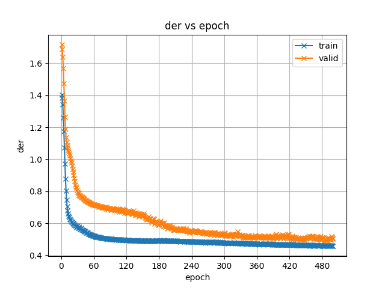
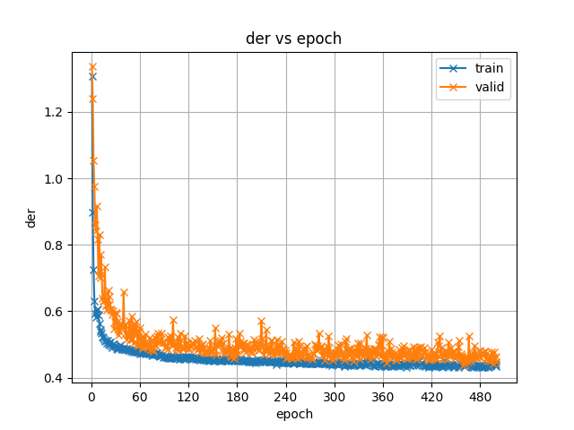

# README

The AMI corpus is a multimodal dataset consisting of 100 hours of meeting recordings. Each meeting session lasts approximately 30 minutes. This document provides an overview of the data processing steps, training procedures for EEND [[1]] and EEND-EDA [[2]], and includes example training results.

## Data Processing

The data processing script is located at `local/data.sh`, which contains the following stages: 

- **Stage 1: Cloning the Setup Files for the AMI Dataset** 

  In this recipe, we use the dataset partition and RTTMs provided by the paper [[3]]. The official GitHub repository containing the AMI setup files is available [[4]]. Additionally, we rely on a pyannote fork [[5]], which provides train/dev/test set partitions, data protocols, and data download scripts. Our setup builds upon the pyannote fork [[5]], but with the following modifications:

  - **Removal of 2-Channel Audio Files in the Training Set** 

    One of the audio files in the training set, `ES2010d`, contains 2 channels. Since speaker diarization requires single-channel audio, this file is excluded. 

  - **Path Adjustments in the `database.yml` Protocol File** 

    The `database.yml` configuration file specifies the paths for RTTM files and audio recordings. To ensure compatibility with ESPNet's directory structure, we modify the paths in this file.

  These modifications to the setup files are included in the fork [[6]]. At this stage, we proceed by cloning this fork.

- **Stage 2: Donwloading AMI Dataset**

   There are various types of datasets based on the protocols provided in Stage 1. To determine which dataset type to use, the following three conditions should be specified:

   - `mic_type`: There are two microphone types:

     1. `ihm` (Individual Headset Microphone): Each participant uses a personal headset microphone. 
     2. `sdm` (Single Distant Microphone): A single microphone captures audio from all participants in the room.
   - `if_mini`: Specify this option to indicate whether to use the mini subset of the corresponding full dataset.
   - `sound_type`: Specify the type of sounds to be annotated in the RTTM files. There are three options provided: 
     1. `only_words`: Annotate only spoken words.
     2. `word_and_vocalsounds`: Annotate both spoken words and vocal sounds (e.g., laughter, coughing). This could only be used when `mic_type` is `ihm`.
     3. `None`: Use this option when working with the mini dataset. The `sound_type` should be set to `None` in this case.
   
   Therefore, there are five types of datasets: 
   
   - **Type 1**: Use recordings with `mic_type` set to `ihm`, annotate with `only_words`, and use the full dataset (set `if_mini` to false).
   
   - **Type 2**: Use recordings with `mic_type` set to `ihm`, annotate with `only_words`, and use the subset dataset (set `if_mini` to true).
   
   - **Type 3**: Use recordings with `mic_type` set to `ihm`, annotate with `word_and_vocalsounds`, and use the full dataset (set `if_mini` to false).
   
   - **Type 4**: Use recordings with `mic_type` set to `sdm`, annotate with `only_words`, and use the full dataset (set `if_mini` to false).
   
   - **Type 5**: Use recordings with `mic_type` set to `sdm`, annotate with `only_words`, and use the subset dataset (set `if_mini` to true).
   
   To determine which dataset type to use, the conditions can be set in the `run.sh` (or `run_eda.sh` for EEND-EDA) script. Once the dataset type is determined, the dataset download script is used to download the corresponding audio files. By default, dataset type 1 is selected.

- **Stage 3: Audio Segmentation**

  The average audio length in the AMI dataset is approximately 35 minutes, which is too long for effective model training. To address this, we segment the raw audio into smaller chunks and align these segments with the original RTTM annotations. Instead of segmenting the raw audio into fixed lengths, we segment it while preserving full utterances within each segment. In other words, we avoid splitting sections annotated as utterances spoken by a speaker and avoid splitting overlapping utterances, whether fully or partially overlapping. Although this method results in more complex segmentation and variable segment lengths, it eliminates non-speech durations from the audio. Consequently, all segments contain only speech, which is beneficial for model training. The code for this stage is located in `local/segment_wav_rttm.py`. 

  We define a configuration parameterr, `duration`, to set the minimum length for the segmented audio files. Additionally, we introduce a `THRESHOLD_LONGEST_SEGMENT` to limit the maximum length of the segmented audio files. This threshold is necessary because we observed that some segments are excessively long, primarily due to the presence of multiple overlapping utterances. If these long segments are preserved, they could cause memory issues during the subsequent training process.

  It is recommended to set the `duration` value in the `run.sh` (or `run_eda.sh` for EEND-EDA) script, and configure `THRESHOLD_LONGEST_SEGMENT` in `local/segment_wav_rttm.py`. By default, we set `duration` to 20 seconds and `THRESHOLD_LONGEST_SEGMENT` to 90 seconds.

  In our segmentation process, we drop the tail segments of the raw audio whose speech duration is shorter than the specified `duration`. Additionally, there is another reason to drop these tail segments: some RTTM files, such as `TS3007c` in the training set of dataset Type 1, have an end time for the last utterance that exceeds the length of the corresponding audio file. This discrepancy is likely due to incorrect annotations of AMI dataset at the end of the audio, while the preceding annotations are correct. Dropping these tail segments helps preserve the accuracy of the annotations. 

- **Stage 4: Kaldi Files Preparation**

  In this stage, we prepare the dataset configuration files. The `wav.scp` file stores the paths to the segmented audio files, `utt2spk` maps utterances to speakers, and `segments` contains the start and end time information for each utterance. These files are generated by `local/prepare_kaldi_files.py`. The `spk2utt` file, which maps speakers to utterances, is generated using the ESPNet's official tool `utils/utt2spk_to_spk2utt.pl`. 

  In this stage, we use the `num_spk` parameter to filter data based on the specified number of speakers. The AMI dataset includes recordings with 3 to 5 speakers, with the majority featuring 4 speakers. For instance, the distribution of speaker counts in Dataset Type 1 is as follows:

  - Train set:
    - 4 speakers: 129 audio files
    - 3 speakers: 4 audio files
    - 5 speakers: 3 audio files
  - Dev set:
    - All audio files with 4 speakers
  - Test set:
    - 4 speakers: 15 audio files
    - 3 speakers: 1 audio files

  (Note: The counts above refer to the full audio files before segmentation.)

  When filtering segment audio files by `num_spk`, we first determine the number of speakers in their corresponding full audio file. If the number of speakers does not match the specified `num_spk`, we exclude those segment audio files. This ensures that the selected segments originate from audio files with the desired number of speakers. However, due to segmentation, the actual number of speakers in a segment may be fewer than `num_spk`. To ensure that all segments of a full audio file have a consistent number of speakers, we add placeholder utterances to the `segments` and `utt2spk` files to account for the missing speakers.

  The placeholder utterances for missing speakers are added as entries in the `segments` file with the missing speaker ID, a start time of 0, and an end time of 1 sample (i.e., 1 / sampling rate in seconds). The end time is set to 1 sample instead of 0 due to restrictions in the subsequent stages of `diar`, which require the end time to be greater than the start time. However, this single sample will not affect the labels in later stages, as the audio will be subsampled from 16 kHz to 8 kHz, effectively reducing one sample to 0. Additionally, the placeholder utterances are added to the `utt2spk` file to maintain a consistent mapping between speakers and their corresponding utterances. 

## Training Setup, Configurations, and Performance Evaluation

We provide training examples for both EEND and EEND-EDA, with their corresponding run scripts located in `run.sh`and `run_eda.sh`. For both models, we adhere to the input and model configurations outlined in paper [[2]].

**Configurations**:

- **EEND**:
  - Use ESPNet's default frontend to extract features. The sampling rate is 8000 Hz, with a frame length of 25 ms and a frame shift of 10 ms. The frontend extracts 23 log-scaled Mel-filterbanks. 
  - Follow the frame concatenation and subsampling strategy described in paper [[2]]. Each frame is concatenated with the preceding and following 7 frames, followed by subsampling with a factor of 10. As a result, a 345-dimensional acoustic feature (23 × 15) is extracted for each 100 ms.
  - Training and testing are performed exclusively on data with 4 speakers.
  - Use 4 layer stacked Transformer encoder, each outputs 256-dimensional frame-wise embeddings. 
  - The training process spans 500 epochs.
  - Detailed configurations are defined in `conf/train_diar.yaml`.
  - The inference stage configuration is located in `conf/decode_diar.yaml`. When scoring the inference results, apply the same subsampling factor of 10 used during the training stage to scale the timestamps in the estimated RTTM file, aligning them with the original audio timeline.
- **EEND-EDA**:
  - Use the same feature extraction, frame concatenation, subsampling strategy, and configuration as used in EEND's experiment.
  - Use 4 layer stacked Transformer encoder, each outputs 256-dimensional frame-wise embeddings. 
  - Use the ESPNet' standard rnn attractor (LSTM) with hidden size of 256. 
  - Initial training uses data with 4 speakers for 500 epochs, following `conf/train_diar_eda.yaml`.
  - Adaptation involves fine-tuning the model using data with 3 and 5 speakers for 20 epochs respectively, using `conf/train_diar_eda_adapt.yaml`.
  - Inferencing and scoring are conducted on 4-speaker data, with the configuration specified in `conf/decode_diar_eda_spk4.yaml`. As with EEND, the subsampling factor of 10 is used to scale up timestamps in the estimated RTTM file to match the original audio timeline during scoring.

**Results**:

- **EEND**:
  - DER during training and evaluation:

    
  - DER of the diarized speech during inference stage on the test set:
    |threshold_median_collar|DER|
    |---|---|
    |result_th0.3_med11_collar0.0|71.73|
    |result_th0.3_med1_collar0.0|74.62|
    |result_th0.4_med11_collar0.0|70.10|
    |result_th0.4_med1_collar0.0|71.98|
    |result_th0.5_med11_collar0.0|70.57|
    |result_th0.5_med1_collar0.0|72.44|
    |result_th0.6_med11_collar0.0|72.64|
    |result_th0.6_med1_collar0.0|74.63|
    |result_th0.7_med11_collar0.0|76.52|
    |result_th0.7_med1_collar0.0|78.41|
  - DER of the diarized speech during inference stage on the development set:
    |threshold_median_collar|DER|
    |---|---|
    |result_th0.3_med11_collar0.0|75.88|
    |result_th0.3_med1_collar0.0|78.21|
    |result_th0.4_med11_collar0.0|71.45|
    |result_th0.4_med1_collar0.0|73.32|
    |result_th0.5_med11_collar0.0|70.53|
    |result_th0.5_med1_collar0.0|72.34|
    |result_th0.6_med11_collar0.0|72.03|
    |result_th0.6_med1_collar0.0|73.96|
    |result_th0.7_med11_collar0.0|76.66|
    |result_th0.7_med1_collar0.0|78.33|
- **EEND-EDA**:
  - DER during training and evaluation with 4 speaker data:

    
  - DER of the diarized speech during inference stage on the test set (4 speaker):
    |threshold_median_collar|DER|
    |---|---|
    |result_th0.3_med11_collar0.0|72.44|
    |result_th0.3_med1_collar0.0|74.64|
    |result_th0.4_med11_collar0.0|70.60|
    |result_th0.4_med1_collar0.0|72.30|
    |result_th0.5_med11_collar0.0|70.45|
    |result_th0.5_med1_collar0.0|72.02|
    |result_th0.6_med11_collar0.0|71.85|
    |result_th0.6_med1_collar0.0|73.41|
    |result_th0.7_med11_collar0.0|75.56|
    |result_th0.7_med1_collar0.0|77.02|
  - DER of the diarized speech during inference stage on the development set (4 speaker):
    |threshold_median_collar|DER|
    |---|---|
    |result_th0.3_med11_collar0.0|74.37|
    |result_th0.3_med1_collar0.0|75.96|
    |result_th0.4_med11_collar0.0|71.69|
    |result_th0.4_med1_collar0.0|72.94|
    |result_th0.5_med11_collar0.0|70.83|
    |result_th0.5_med1_collar0.0|72.12|
    |result_th0.6_med11_collar0.0|71.96|
    |result_th0.6_med1_collar0.0|73.34|
    |result_th0.7_med11_collar0.0|75.81|
    |result_th0.7_med1_collar0.0|76.99|

## Contributors

Qingzheng Wang

qingzhew@andrew.cmu.edu

Thanks to **Professor Shinji Watanabe** for his guidance!

## References

[1]: https://arxiv.org/pdf/1909.06247	"Fujita, Yusuke, et al. End-to-end neural speaker diarization with self-attention. 2019 IEEE Automatic Speech Recognition and Understanding Workshop (ASRU). IEEE, 2019."
[2]: https://arxiv.org/pdf/2106.10654	"Horiguchi, Shota, et al. Encoder-decoder based attractors for end-to-end neural diarization. IEEE/ACM Transactions on Audio, Speech, and Language Processing 30 (2022): 1493-1507."
[3]: https://arxiv.org/pdf/2012.14952	"Landini, Federico, et al. Bayesian hmm clustering of x-vector sequences (vbx) in speaker diarization: theory, implementation and analysis on standard tasks. Computer Speech &amp; Language 71 (2022): 101254."
[4]: https://github.com/BUTSpeechFIT/AMI-diarization-setup	"BUT SpeechFIT. AMI-Diarization-Setup. GitHub, https://github.com/BUTSpeechFIT/AMI-diarization-setup. Accessed 18 Dec. 2024."
[5]: https://github.com/pyannote/AMI-diarization-setup/tree/main	"pyannote. GitHub, 2024, https://github.com/pyannote/AMI-diarization-setup/tree/main. Accessed 18 Dec. 2024."
[6]: https://github.com/Qingzheng-Wang/AMI-diarization-setup	"Wang, Qingzheng. AMI-diarization-setup. GitHub, 2024, https://github.com/Qingzheng-Wang/AMI-diarization-setup. Accessed 18 Dec. 2024."

[[1]] Fujita, Yusuke, et al. End-to-end neural speaker diarization with self-attention. 2019 IEEE Automatic Speech Recognition and Understanding Workshop (ASRU). IEEE, 2019.

[[2]] Horiguchi, Shota, et al. Encoder-decoder based attractors for end-to-end neural diarization. IEEE/ACM Transactions on Audio, Speech, and Language Processing 30 (2022): 1493-1507.

[[3]] Landini, Federico, et al. Bayesian hmm clustering of x-vector sequences (vbx) in speaker diarization: theory, implementation and analysis on standard tasks. Computer Speech &amp; Language 71 (2022): 101254.

[[4]] BUT SpeechFIT. AMI-Diarization-Setup. GitHub, https://github.com/BUTSpeechFIT/AMI-diarization-setup. Accessed 18 Dec. 2024.

[[5]] pyannote. GitHub, 2024, https://github.com/pyannote/AMI-diarization-setup/tree/main. Accessed 18 Dec. 2024.

[[6]] Wang, Qingzheng. AMI-diarization-setup. GitHub, 2024, https://github.com/Qingzheng-Wang/AMI-diarization-setup. Accessed 18 Dec. 2024.
