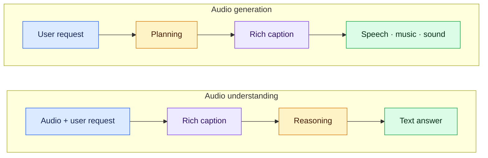

<div align="center">

<h1>🎵 Bagpiper</h1>
<h3>Solving Open-Ended Audio Tasks via Rich Captions</h3>
<p><strong>One 8B model for understanding and generating speech, music, sound, and their mixtures.</strong></p>
<p>Carnegie Mellon University · LY Corporation · NVIDIA</p>

<p>
  <a href="https://arxiv.org/abs/2602.05220"></a>
  <a href="https://huggingface.co/collections/espnet/bagpiper"></a>
  <a href="https://bagpiper-web.github.io/"></a>
</p>

<p>
  <a href="https://openreview.net/forum?id=FuHs64E3X6">COLM paper</a> ·
  <a href="https://arxiv.org/pdf/2602.05220">PDF</a> ·
  <a href="https://huggingface.co/espnet/bagpiper-sft">Instruction-tuned model</a> ·
  <a href="https://huggingface.co/datasets/espnet/Bagpiper_SFT_Data">SFT dataset</a> ·
  <a href="../../bagpiper_tts/speechlm1/README.md">Bagpiper-TTS</a>
</p>

<p><a href="#how-bagpiper-works">Overview</a> · <a href="#models-and-data">Releases</a> · <a href="#inference">Inference</a> · <a href="#training">Training</a> · <a href="#citation">Citation</a></p>

</div>

Bagpiper connects audio waveforms with **rich captions**: detailed natural-language
descriptions of what is said, how it sounds, and what happens in the acoustic
scene. A caption can describe words, speakers, emotion, prosody, instruments,
sound events, and their relationships. This shared representation supports
open-ended questions and generation requests across audio types.

The [COLM 2026 paper](https://openreview.net/forum?id=FuHs64E3X6) introduces
bidirectional audio–caption pretraining with a **600B-token budget**, followed by
instruction tuning that teaches the model to describe and reason before answering
or generating audio. This directory provides its ESPnet SpeechLM training recipe.

## How Bagpiper works



These are two directions of **one end-to-end model**. Bagpiper-Base learns
`audio ↔ rich caption`; the general SFT model adds instruction following and
the caption-then-process workflow shown above.

| Capability | What to explore on the [demo page](https://bagpiper-web.github.io/) |
| --- | --- |
| **Understand audio** | Transcribe speech, answer questions, and reason about delivery, music, sound events, and scene context. |
| **Generate audio** | Describe speech, music, environmental sounds, or combinations of them in a natural-language request. |
| **Compose scenes** | Explore examples combining dialogue, singing, background music, and effects. |
| **Inspect the caption** | Read the intermediate description and planning alongside the audio examples. |

### Architecture

| Component | Configuration |
| --- | --- |
| Language backbone and tokenizer | [Qwen3-8B-Base](https://huggingface.co/Qwen/Qwen3-8B-Base) |
| Audio input | [Qwen3-Omni audio encoder](https://huggingface.co/Qwen/Qwen3-Omni-30B-A3B-Instruct), connected through an adaptor |
| Audio output | [X-Codec](https://huggingface.co/hf-audio/xcodec-hubert-general), eight delay-interleaved token streams |
| Sequence interface | Interleaved text and audio, modeled with next-token prediction |

### Selected paper results

The following results evaluate the **general SFT model** in Table 5 of the paper;
they are separate from the pretrained Base probes and were not rerun by this recipe.

| Benchmark | Metric | Bagpiper |
| --- | --- | ---: |
| LibriSpeech test-clean | Word error rate ↓ | **2.5%** |
| MMAU-Mini | Accuracy ↑ | **74.5%** |
| MMAU | Accuracy ↑ | **73.1%** |
| MMAR | Accuracy ↑ | **57.0%** |

See the [paper](https://arxiv.org/abs/2602.05220) for evaluation protocols, Base
probes, generation comparisons, and ablations. The
[audio gallery](https://bagpiper-web.github.io/) showcases the open-ended
generation behavior beyond these understanding benchmarks.

## Models and data

All releases are grouped in the [ESPnet Bagpiper collection](https://huggingface.co/collections/espnet/bagpiper).

| Release | Use it for | Native weight file |
| --- | --- | --- |
| [Bagpiper-Base](https://huggingface.co/espnet/bagpiper) | Audio–caption mapping and downstream fine-tuning initialization | `base.pt` |
| [Bagpiper SFT](https://huggingface.co/espnet/bagpiper-sft) | Open-ended audio understanding and generation | `model.pt` |
| [Bagpiper-TTS SFT](https://huggingface.co/espnet/bagpiper-tts-sft) | Natural-language-guided speech synthesis; see the [TTS recipe](../../bagpiper_tts/speechlm1/README.md) | `model.pt` |
| [Bagpiper SFT Data](https://huggingface.co/datasets/espnet/Bagpiper_SFT_Data) | Generation and understanding conversations | Parquet dataset |

The model repositories include checkpoint-compatible YAML configurations.
Published `.pt` files contain model weights under `module`; training produces
PyTorch Distributed Checkpoint (**DCP**) directories with resume state. Native
ESPnet inference reads a single `.pt` file. Export a trained DCP before inference
or conversion for vLLM.

## Inference

For a first look, [listen to the demos](https://bagpiper-web.github.io/).
To run the model locally, activate the environment from the
[SpeechLM installation guide](../../../espnet2/speechlm/INSTALL.md).

### Native ESPnet

Run from the **ESPnet repository root**. Download the instruction-tuned model:

```bash
hf download espnet/bagpiper-sft --local-dir models/bagpiper-sft
```

Prepare a SpeechLM `dialogue` dataset manifest at `/path/to/requests.json` with
the user requests and, for understanding, input audio. The dialogue reader expects
JSONL rows with `example_id` and `messages`, where each message is
`[role, modality, content]`. For audio messages, `content` is a local audio-file
path. Use the manifest format in [Setup and inputs](#setup-and-inputs).
The [model card](https://huggingface.co/espnet/bagpiper-sft) describes the
released configurations. For text-then-audio generation:

From the recipe directory, which takes the published weights straight
through without an export step. `run.sh` resolves relative paths from
the recipe directory, so the download directory is given in full here:

```bash
./run.sh --stage 5 \
    --train-config /path/to/bagpiper-sft/train_stage3_qwen3_base.yaml \
    --inference-config /path/to/bagpiper-sft/inference_audio.yaml \
    --export-path /path/to/bagpiper-sft/model.pt \
    --test-unregistered-specifier "dialogue:demo:/path/to/requests.json" \
    --inference-output-dir exp/bagpiper-demo
```

Or call the module directly, from the repository root:

```bash
python -m espnet2.speechlm.bin.inference \
    --train-config models/bagpiper-sft/train_stage3_qwen3_base.yaml \
    --inference-config models/bagpiper-sft/inference_audio.yaml \
    --model-checkpoint models/bagpiper-sft/model.pt \
    --test-unregistered-specifier "dialogue:demo:/path/to/requests.json" \
    --output-dir exp/bagpiper-demo
```

For audio understanding and text answers, use `inference_text.yaml` with an
audio-containing dialogue manifest. The decoder writes text results and generated
WAV files under the output directory. Native inference requires CUDA; the default
is one worker on one GPU. The released generation configuration enforces text
followed by audio and uses classifier-free guidance (`cfg: 3`) for audio.

### vLLM serving

The [ESPnet vLLM fork](https://github.com/espnet/vllm) provides conversion tools
and an OpenAI-compatible serving API. Follow its
[checkpoint conversion guide](https://github.com/espnet/vllm/blob/main/examples/espnet/MODELS.md)
and [reference clients](https://github.com/espnet/vllm/blob/main/examples/espnet/clients/README.md).
A native `.pt` file must be converted into a vLLM model directory first.

The fork currently documents **general-SFT audio generation as unsupported**
because its decoding path does not enforce the text-to-audio transition required
by that checkpoint. Use native ESPnet for this workflow. The fork documents
speech-generation support for the TTS-SFT checkpoint; see the
[Bagpiper-TTS serving instructions](../../bagpiper_tts/speechlm1/README.md#vllm-serving).

## Setup and inputs

Activate the [SpeechLM environment](../../../espnet2/speechlm/INSTALL.md)
before launching training. `run.sh` uses the active Python environment and
invokes `torchrun` directly. See the
[template's training-only layout](../../TEMPLATE/speechlm1/README.md#training-only-recipes)
for environment activation and scheduler integration.

Training starts from prepared inputs:

- **Dataset manifests:** SpeechLM JSON files containing `data_entry` and
  `samples`, with paths to the corresponding text, audio, or dialogue files.
- **Length statistics:** `stats_<task>_<name>.jsonl`, with one
  `{"example_id": length}` record per line for each task/dataset combination.

Convert Hub Parquet data into these manifests and reader inputs before training.
Consult the [dataset card](https://huggingface.co/datasets/espnet/Bagpiper_SFT_Data)
for its schema and current release status.

For a dialogue dataset, the manifest names its JSONL reader input and example IDs:

```json
{
  "data_entry": [
    {"name": "dialogue", "reader": "dialogue", "path": "/path/to/dialogues.jsonl"}
  ],
  "samples": ["example_001", "example_002"]
}
```

Each JSONL row contains `example_id` and `messages`, with messages represented as
`[role, modality, content]`. Training rows include the assistant's target text/audio;
inference rows can contain only the user request and any input audio.

Pass space-separated `task:name:dataset.json[:factor]` specifiers. Supported
tasks are `text_to_audio`, `audio_to_text`, `text_only`, and `dialogue`; use
distinct training and validation names. Registered datasets instead use
`--train-registered-specifier` / `--valid-registered-specifier` with
`task:name[:factor]` and `ESPNET_DATASET_REGISTRY`.

The recipe uses BF16 and TorchTitan FSDP2. The default FlashAttention-3 backend
targets Hopper GPUs such as H100/H800. On other hardware, select a supported
backend for both `model.model_conf.attn_implementation` and
`multimodal_io.continuous_audio.attn_implementation`.

**Checkpoint compatibility:** preserve the original `multimodal_io` mapping
order, tokenizer, codec, and architecture when using existing weights. Vocabulary
IDs depend on that order. When saving a modified configuration with PyYAML, use
`yaml.safe_dump(config, sort_keys=False)`.

## Training

### Curriculum and recipe defaults

| Stage | Configuration | Initialization | Steps | Peak LR | LR warmup | Accumulation | Min. LR ratio |
| --- | --- | --- | ---: | ---: | ---: | ---: | ---: |
| **Warmup** | [conf/train.yaml](conf/train.yaml) | Qwen3-8B-Base | 10,000 | 5e-4 | 100 | 4 | 1.0 |
| **Pretraining** | [conf/tuning/train_pretrain.yaml](conf/tuning/train_pretrain.yaml) | Warmup checkpoint | 600,000 | 1e-4 | 5,000 | 4 | 0.3 |
| **SFT** | [conf/tuning/train_sft.yaml](conf/tuning/train_sft.yaml) | Pretrained checkpoint | 50,000 | 1e-5 | 1,000 | 1 | 0.1 |

The audio encoder and codec remain frozen throughout. Warmup also freezes the
decoder layers while training the multimodal interface; pretraining and SFT
train the decoder. Warmup keeps a constant LR after its initial ramp; the later
stages use cosine decay.

These are **TorchTitan starting configurations**, separate from the paper's
original training schedule and 600B-token budget. Each stage packs up to 8,192
tokens per GPU per micro-batch. Adjust the token budget, accumulation, number of
steps, and LR schedule for your data and hardware. `dp_shard: -1` uses the GPU
count selected by the launcher.

### Launch the stages

Run from `egs2/bagpiper/speechlm1`, replacing the paths with prepared manifests
and statistics. `./run.sh` runs five stages in order: warmup, pretraining,
SFT, export, and inference. Use `--stage` / `--stop-stage` to select a range.
For warmup alone:

```bash
./run.sh --stage 1 --stop-stage 1 --ngpu 8 \
    --stats-dir /path/to/pretrain_stats \
    --train-unregistered-specifier "text_to_audio:train:/path/to/train.json audio_to_text:train:/path/to/train.json text_only:text_train:/path/to/text_train.json" \
    --valid-unregistered-specifier "text_to_audio:valid:/path/to/valid.json audio_to_text:valid:/path/to/valid.json text_only:text_valid:/path/to/text_valid.json"
```

For pretraining, repeat the data arguments with `--stage 2 --stop-stage 2`.
Each stage's configuration, output directory, and starting weights are written
in `run.sh`. Pretraining initializes from the latest complete checkpoint of
`exp/warmup` and continues `exp/pretrain` once that has a checkpoint of its own.
Restart an interrupted run with the same command. The paper balances caption-to-audio,
audio-to-caption, and text-only training through their token budgets; configure
your data mixture and sampling factors accordingly.

For SFT, use prepared instruction dialogues with rich captions and the
task-appropriate text/audio turns:

```bash
./run.sh --stage 3 --stop-stage 3 --ngpu 8 \
    --stats-dir /path/to/sft_stats \
    --train-unregistered-specifier "dialogue:sft_train:/path/to/sft_train.json" \
    --valid-unregistered-specifier "dialogue:sft_valid:/path/to/sft_valid.json"
```

You can also initialize SFT directly from the released Bagpiper-Base `base.pt`
with a matching model configuration, by passing it as `--resume-path`.
`--train-config` and `--output-dir` can override the selected training stage;
select only one training stage when using these overrides.

To run several training stages together, supply separate SFT inputs with
`--sft-stats-dir`, `--sft-train-specifier`, and `--sft-valid-specifier`.
Running through stage 5 also needs `--inference-config` and
`--test-unregistered-specifier`. An explicit `--resume-path` initializes only
the first selected training stage; subsequent stages use its checkpoints.

### Initialize, resume, and export

| Operation | How to run it |
| --- | --- |
| Run the next stage | `--stage 2 --stop-stage 2` or `--stage 3 --stop-stage 3`. The recipe starts it from the latest complete checkpoint of the stage before it, with a fresh optimizer, scheduler and step counter. |
| Continue an interrupted stage | The same command again. Once a stage's own output directory has a checkpoint, the recipe continues from it rather than starting over, and the optimizer, scheduler and step come back with it. |
| Start from other weights | `--resume-path` with a complete native `.pt` file or DCP directory. It wins over the stage chaining. |
| Decode without training | `--stage 5` with `--export-path` and `--train-config` pointing at a downloaded model directory. |
| Prepare weights for inference | Export the model from DCP into a single `.pt` file with the command below. |

Native weight initialization requires an exactly matching model configuration
and `pp_degree: 1`; multi-GPU FSDP initialization is supported. Model construction
loads the pretrained components before replacing their weights with the selected
checkpoint. Keep gradient accumulation unchanged across resume, since data
progress is measured in micro-batches; the launcher saves batch assignments by default.

Export on CPU with enough RAM for the full model. The recipe takes the
latest complete checkpoint:

```bash
./run.sh --stage 4 --stop-stage 4
```

Name another one with `--checkpoint-dir`. Export refuses to overwrite an
existing file; use a new `--export-path` when exporting updated weights, or
run stage 5 to decode the existing export. Inference uses the saved training
configuration when available, unless `--train-config` is supplied.
You can also call the module directly:

```bash
python -m espnet2.speechlm.bin.export_checkpoint \
    --checkpoint-dir exp/sft/checkpoints/step_50000 \
    --output exp/sft/model.pt --dtype bfloat16
```

For multiple nodes, launch on each node with `--num-nodes N --node-rank R
--master-addr HOST --master-port PORT` and shared data/output paths. `--ngpu`
counts GPUs per node. Relative paths resolve from the recipe directory;
`./run.sh --help` lists the options, and W&B is disabled by default.
Export and inference run only on node rank 0, avoiding duplicate writes to
shared output paths.

## Citation

```bibtex
@inproceedings{tian2026bagpiper,
  title     = {Bagpiper: Solving Open-Ended Audio Tasks via Rich Captions},
  author    = {Jinchuan Tian and Haoran Wang and Bo-Hao Su and Chien-yu Huang and
               Qingzheng Wang and Jiatong Shi and William Chen and Xun Gong and
               Siddhant Arora and Chin-Jou Li and Masao Someki and Takashi Maekaku and
               Keita Goto and Yusuke Shinohara and Jin Sakuma and
               Chao-Han Huck Yang and Shinji Watanabe},
  booktitle = {Third Conference on Language Modeling},
  year      = {2026},
  url       = {https://openreview.net/forum?id=FuHs64E3X6}
}
```
