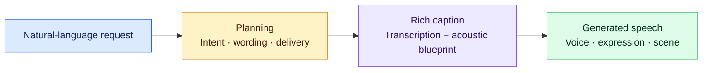

<div align="center">

<h1>🎙️ Bagpiper-TTS</h1>
<h3>Natural Language Guided Universal Speech Synthesis</h3>
<p><strong>Describe what you want to hear. One model plans, captions, and speaks.</strong></p>
<p>Carnegie Mellon University · LY Corporation · NVIDIA</p>

<p>
  <a href="https://www.isca-archive.org/interspeech_2026/tian26_interspeech.html"></a>
  <a href="https://huggingface.co/espnet/bagpiper-tts-sft"></a>
  <a href="https://bagpipertts.github.io/bagpiper_tts_demo/"></a>
</p>

<p>
  <a href="https://www.isca-archive.org/interspeech_2026/tian26_interspeech.pdf">PDF</a> ·
  <a href="https://arxiv.org/abs/2606.22811">arXiv</a> ·
  <a href="https://huggingface.co/datasets/espnet/Bagpiper_TTS_SFT_Data">SFT dataset</a> ·
  <a href="https://huggingface.co/collections/espnet/bagpiper">Bagpiper collection</a> ·
  <a href="../../bagpiper/speechlm1/README.md">Bagpiper foundation model</a>
</p>

<p><a href="#from-request-to-speech">Overview</a> · <a href="#what-can-you-ask-for">Applications</a> · <a href="#inference">Inference</a> · <a href="#fine-tuning">Fine-tuning</a> · <a href="#citation">Citation</a></p>

</div>

Bagpiper-TTS is an **8B speech synthesis model controlled through natural
language**. A request can specify words, voice characteristics, emotion, delivery,
characters, or a whole scene. The model interprets the request, develops a textual
plan, writes a rich caption, and synthesizes the audio in one end-to-end sequence.

The [Interspeech 2026 paper](https://www.isca-archive.org/interspeech_2026/tian26_interspeech.html)
builds on Bagpiper-Base's audio–caption alignment and fine-tunes it on approximately
**738k examples** spanning six application groups. The same interface supports
classical TTS, multi-talker dialogue, intent-to-speech, role-play, singing, and
general speech scenes. Requests use text; speaker characteristics are described
in words rather than supplied through a reference audio clip.

## From request to speech



The **plan** resolves the user's intent and the requested delivery. The
**rich caption** turns that plan into a detailed blueprint containing the words
and acoustic attributes. Audio generation then uses the caption-to-audio mapping
learned by [Bagpiper-Base](../../bagpiper/speechlm1/README.md).

For example, the paper's intent-to-speech request is:

> Help me say happy new year to Bob with a cheerful male voice.

Here, the model must compose the greeting as well as decide how to speak it.
An explicit TTS request instead supplies the exact line and describes its delivery.

## What can you ask for?

The examples below illustrate the application groups in the paper. Visit the
[demo gallery](https://bagpipertts.github.io/bagpiper_tts_demo/) to hear generated
samples and inspect their requests, plans, and captions.

| Application | What the request specifies | Example request |
| --- | --- | --- |
| **Classical TTS** | Exact words with voice and delivery instructions | Say “Let's see…” in a bright, curious voice in a quiet studio. |
| **Multi-talker** | Dialogue, speaker traits, and turn order | Create a two-speaker exchange: a calm man asks a question, then a lively woman replies. |
| **Intent-to-speech** | A communicative goal without exact wording | Wish Bob a happy new year in a cheerful male voice. |
| **Role-play** | A character and situation that imply a delivery style | A strict teacher in his fifties says, “Everyone, look at the blackboard!” |
| **Singing voice synthesis** | Lyrics and musical or acoustic context | A female voice sings “we are all together” with a dreamy cathedral ambience. |
| **General-purpose** | Speech scenes combining events or unusual instructions | A speaker says “Welcome, my friends!” followed by audience applause. |

### Paper results

| Evaluation | Reported result |
| --- | ---: |
| Seed-TTS-Eval English | **1.7% WER** |
| Mean task fulfillment over four advanced applications, Gemini-3-Flash | **4.09 / 5** |
| Mean human score over four advanced applications | **3.69 / 5** |

These are the paper's results, separate from validation of this recipe. The four
advanced applications are multi-talker, intent-to-speech, role-play, and singing;
the general-purpose group is studied qualitatively. See Tables 1–2 and §2.4 of the
[paper](https://www.isca-archive.org/interspeech_2026/tian26_interspeech.pdf)
for protocols, per-application results, and the scope of the human evaluation.

## Models and data

| Resource | Contents |
| --- | --- |
| [Bagpiper-TTS SFT](https://huggingface.co/espnet/bagpiper-tts-sft) | `model.pt`, checkpoint-compatible `train_bagpiper_tts.yaml`, and `inference.yaml` |
| [Bagpiper-TTS SFT Data](https://huggingface.co/datasets/espnet/Bagpiper_TTS_SFT_Data) | Request, planning/caption text, and audio across the six application groups |
| [Bagpiper-Base](https://huggingface.co/espnet/bagpiper) | Pretrained `base.pt` for initializing a new speech fine-tune |
| [Bagpiper collection](https://huggingface.co/collections/espnet/bagpiper) | Both papers, the model family, and SFT datasets |

Bagpiper-TTS inherits the Qwen3-8B-Base backbone and eight-stream,
delay-interleaved X-Codec audio output. The recipe also includes the Qwen3-Omni
audio input encoder; both encoder and codec stay frozen during fine-tuning.

## Inference

### Native ESPnet

Activate the environment from the
[SpeechLM installation guide](../../../espnet2/speechlm/INSTALL.md), then run
from the **ESPnet repository root**:

```bash
hf download espnet/bagpiper-tts-sft --local-dir models/bagpiper-tts-sft
```

Prepare a SpeechLM `dialogue` dataset manifest at `/path/to/tts_requests.json`
with user text requests. The paper's training conversations use no system prompt;
the requests themselves describe the application. The dialogue reader expects
JSONL rows with `example_id` and `messages`; a single request can be represented
as `[["user", "text", "Wish Bob a happy new year in a cheerful male voice."]]`.
See the
[model card](https://huggingface.co/espnet/bagpiper-tts-sft) for release details and
the [Bagpiper input format](../../bagpiper/speechlm1/README.md#setup-and-inputs)
for the manifest structure.

From the recipe directory, which takes the published weights straight
through without an export step. `run.sh` resolves relative paths from
the recipe directory, so the download directory is given in full here:

```bash
./run.sh --stage 3 \
    --train-config /path/to/bagpiper-tts-sft/train_bagpiper_tts.yaml \
    --inference-config /path/to/bagpiper-tts-sft/inference.yaml \
    --export-path /path/to/bagpiper-tts-sft/model.pt \
    --test-unregistered-specifier "dialogue:demo:/path/to/requests.json" \
    --inference-output-dir exp/bagpiper-tts-demo
```

Or call the module directly, from the repository root:

```bash
python -m espnet2.speechlm.bin.inference \
    --train-config models/bagpiper-tts-sft/train_bagpiper_tts.yaml \
    --inference-config models/bagpiper-tts-sft/inference.yaml \
    --model-checkpoint models/bagpiper-tts-sft/model.pt \
    --test-unregistered-specifier "dialogue:tts_demo:/path/to/tts_requests.json" \
    --output-dir exp/bagpiper-tts-demo
```

The released decoding configuration generates text followed by audio and uses
classifier-free guidance (`cfg: 3`) during audio generation, as in the paper.
Results include the generated text and WAV files. Native inference requires CUDA
and defaults to one worker on one GPU.

**Checkpoint format:** native inference loads a single `model.pt`, with model
state under the `module` key. Export TorchTitan DCP training checkpoints before
using them for native inference or vLLM conversion.

### vLLM serving

For an OpenAI-compatible API, use the
[ESPnet vLLM fork](https://github.com/espnet/vllm). Convert the released `.pt`
following the [model conversion guide](https://github.com/espnet/vllm/blob/main/examples/espnet/MODELS.md),
then use its [reference clients](https://github.com/espnet/vllm/blob/main/examples/espnet/clients/README.md)
for the expected conversation format and per-request CFG settings.

The [Docker guide](https://github.com/espnet/vllm/blob/main/examples/espnet/docker/README.md)
describes the prebuilt image and GPU requirements. With a converted model directory:

```bash
docker run --rm --gpus all \
    -v /path/to/converted-checkpoint:/models/bagpiper \
    -v ~/.cache/huggingface:/root/.cache/huggingface \
    -p 127.0.0.1:9811:9811 \
    --entrypoint bash espnet/vllm:latest \
    -c 'MODEL_PATH=/models/bagpiper bash /workspace/vllm-fork/examples/espnet/serve_bagpiper.sh'
```

The endpoint is `http://127.0.0.1:9811/v1/chat/completions`, with served model
name `bagpiper`. Use the fork's reference prompts and clients when serving;
the native decoder and serving fork have different prompting and decoding paths.

## Fine-tuning

### Prepare the inputs

This is a training-only recipe using prepared SpeechLM dataset manifests and
length statistics. Follow the
[Bagpiper setup and input instructions](../../bagpiper/speechlm1/README.md#setup-and-inputs)
and the [launcher template](../../TEMPLATE/speechlm1/README.md#training-only-recipes).

The TTS training conversations have the sequence:

```text
user: text request → assistant: planning + rich caption → assistant: target audio
```

Convert the [Hub Parquet dataset](https://huggingface.co/datasets/espnet/Bagpiper_TTS_SFT_Data)
into dialogue-reader inputs and manifests containing `data_entry` and `samples`;
it cannot be passed directly to the trainer. Use distinct training/validation
dataset names and prepare `stats_dialogue_<name>.jsonl` files. The dataset card
documents its schema and current release status.

### Recipe defaults

| Setting | [conf/train.yaml](conf/train.yaml) |
| --- | --- |
| Trainer | TorchTitan FSDP2, BF16 |
| Packed tokens per GPU per micro-batch | 8,192 |
| Gradient accumulation | 1 |
| Training steps | 50,000 |
| Peak learning rate | 1e-4 |
| LR warmup | 2,000 steps |
| Decay | Cosine to zero |
| Frozen components | Audio encoder and codec |

These are **starting settings for the current trainer**. The paper's original
run used two epochs, a 160k-token global batch, and a constant 1e-5 learning rate;
it reports 16 hours on eight H100 GPUs. Adjust this recipe's schedule and batch
budget for your run rather than treating the defaults as that experiment.

FlashAttention-3 defaults target Hopper GPUs such as H100/H800. On other GPUs,
change both the language-model and continuous-audio attention backends to a
supported implementation. `dp_shard: -1` follows the launcher's GPU count.

**Preserve checkpoint compatibility:** keep the original tokenizer, codec,
architecture, and `multimodal_io` mapping order. Vocabulary IDs depend on the
mapping order; save modified YAML with `yaml.safe_dump(config, sort_keys=False)`.

### Launch a fine-tune

Run from `egs2/bagpiper_tts/speechlm1`. Initialize from a downloaded Bagpiper-Base
checkpoint and replace the example paths with your prepared inputs:

```bash
./run.sh --stage 1 --stop-stage 1 --ngpu 8 \
    --resume-path /path/to/bagpiper-base/base.pt \
    --stats-dir /path/to/tts_stats \
    --train-unregistered-specifier "dialogue:tts_train:/path/to/tts_train.json" \
    --valid-unregistered-specifier "dialogue:tts_valid:/path/to/tts_valid.json"
```

An explicit `--resume-path` accepts complete native `.pt` weights or a Bagpiper
DCP directory. It initializes the model and starts a fresh optimizer, scheduler,
and step counter, even when the output already has checkpoints. Use
`--output-dir` to select a new output directory for a new run, and
`--train-config` to select its matching training configuration. Native weights
require a matching model configuration and `pp_degree: 1`; multi-GPU FSDP
initialization is supported. To continue training the released TTS model, select
its `model.pt` instead of Base weights with the same compatibility checks.

To resume an interrupted run, repeat the command with the same data,
configuration, and output directory, **omitting `--resume-path`**. The latest
complete DCP restores the model, optimizer, scheduler, and step counter. Keep
gradient accumulation unchanged across resume. `./run.sh --help` lists multi-node
and logging options; W&B is disabled by default.
To run through export and inference, omit `--stop-stage` and supply
`--inference-config` and `--test-unregistered-specifier` as well.

### Export for inference

Export the trained DCP on CPU, allowing enough RAM for the full model.
The recipe takes the latest complete checkpoint:

```bash
./run.sh --stage 2 --stop-stage 2
```

Name another one with `--checkpoint-dir`. Export refuses to overwrite an
existing file; use a new `--export-path` when exporting updated weights, or
run stage 3 to decode the existing export. Inference uses the saved training
configuration when available, unless `--train-config` is supplied.
You can also call the module directly:

```bash
python -m espnet2.speechlm.bin.export_checkpoint \
    --checkpoint-dir exp/sft/checkpoints/step_50000 \
    --output exp/sft/model.pt --dtype bfloat16
```

Use this `.pt` with your matching model configuration for native inference,
or convert it for vLLM serving.
For multi-node training, export and inference run only on node rank 0.

## Citation

```bibtex
@inproceedings{tian26_interspeech,
  title     = {Bagpiper-TTS: Natural Language Guided Universal Speech Synthesis},
  author    = {Jinchuan Tian and Haoran Wang and Siddhant Arora and
               Takashi Maekaku and Keita Goto and Jin Sakuma and
               Yusuke Shinohara and Chao-Han Huck Yang and Shinji Watanabe},
  booktitle = {Interspeech 2026},
  year      = {2026},
  pages     = {6658--6663},
  doi       = {10.21437/Interspeech.2026-873},
  url       = {https://www.isca-archive.org/interspeech_2026/tian26_interspeech.html}
}
```

When using the foundation model, also cite the
[Bagpiper paper](../../bagpiper/speechlm1/README.md#citation).
