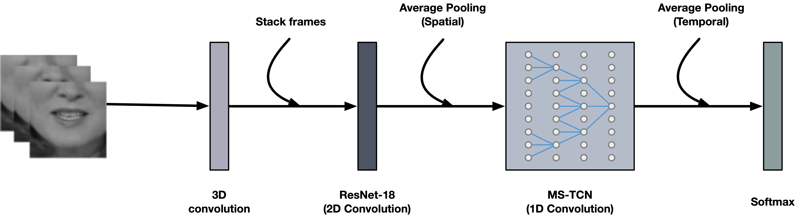

# Lipreading using Temporal Convolutional Networks
[](https://paperswithcode.com/sota/lipreading-on-lip-reading-in-the-wild?p=towards-practical-lipreading-with-distilled)
## Authors
[Pingchuan Ma](https://mpc001.github.io/), [Brais Martinez](http://braismartinez.org), [Stavros Petridis](https://ibug.doc.ic.ac.uk/people/spetridis), [Maja Pantic](https://ibug.doc.ic.ac.uk/people/mpantic).

## Update

`2021-06-09`: We have released our official training code, see [here](#how-to-train).

`2020-12-08`: We have released the audio-only model which achieves the testing accuracy of 98.5% on LRW.

## Content
[Deep Lipreading](#deep-lipreading)
- [Introduction](#introduction)
- [Preprocessing](#preprocessing)
- [How to install the environment](#how-to-install-environment)
- [How to prepare the dataset](#how-to-prepare-dataset)
- [How to train](#how-to-train)
- [How to test](#how-to-test)
- [How to extract embeddings](#how-to-extract-embeddings)

[Model Zoo](#model-zoo)

[Citation](#citation)

[License](#license)

[Contact](#contact)


## Deep Lipreading
### Introduction

This is the respository of [Towards Practical Lipreading with Distilled and Efficient Models](https://sites.google.com/view/audiovisual-speech-recognition#h.p_f7ihgs_dULaj) and [Lipreading using Temporal Convolutional Networks](https://sites.google.com/view/audiovisual-speech-recognition#h.p_jP6ptilqb75s). In this repository, we provide training code, pre-trained models, network settings for end-to-end visual speech recognition (lipreading). We trained our model on [LRW](http://www.robots.ox.ac.uk/~vgg/data/lip_reading/lrw1.html). The network architecture is based on 3D convolution, ResNet-18 plus MS-TCN.

<div align="center"></div>

By using this repository, you can achieve a performance of 87.9% on the LRW dataset. This reporsitory also provides a script for feature extraction.

### Preprocessing

As described in [our paper](https://arxiv.org/abs/2001.08702), each video sequence from the LRW dataset is processed by 1) doing face detection and face alignment, 2) aligning each frame to a reference mean face shape 3) cropping a fixed 96 × 96 pixels wide ROI from the aligned face image so that the mouth region is always roughly centered on the image crop 4) transform the cropped image to gray level.

You can run the pre-processing script provided in the [preprocessing](./preprocessing) folder to extract the mouth ROIs.

<table style="display: inline-table;">  
<tr><td></td><td></td><td></td><td></td></tr>
<tr><td>0. Original</td> <td>1. Detection</td> <td>2. Transformation</td> <td>3. Mouth ROIs</td> </tr>
</table>

### How to install environment

1. Clone the repository into a directory. We refer to that directory as *`TCN_LIPREADING_ROOT`*.

```Shell
git clone --recursive https://github.com/mpc001/Lipreading_using_Temporal_Convolutional_Networks.git
```

2. Install all required packages.

```Shell
pip install -r requirements.txt
```

### How to prepare dataset

1. Download our pre-computed landmarks from [GoogleDrive](https://bit.ly/3huI1P5) or [BaiduDrive](https://bit.ly/2YIg8um) (key: kumy) and unzip them to *`$TCN_LIPREADING_ROOT/landmarks/`* folder.

2. Pre-process mouth ROIs using the script [crop_mouth_from_video.py](./preprocessing/crop_mouth_from_video.py) in the [preprocessing](./preprocessing) folder and save them to *`$TCN_LIPREADING_ROOT/datasets/visual_data/`*.

3. Pre-process audio waveforms using the script [extract_audio_from_video.py](./preprocessing/extract_audio_from_video.py) in the [preprocessing](./preprocessing) folder and save them to *`$TCN_LIPREADING_ROOT/datasets/audio_data/`*.

4. Download a pre-trained model from [Model Zoo](#model-zoo) and put the model into the *`$TCN_LIPREADING_ROOT/models/`* folder.

### How to train

1. Train a visual-only model.

```Shell
CUDA_VISIBLE_DEVICES=0 python main.py --config-path <MODEL-JSON-PATH> \
                                      --annonation-direc <ANNONATION-DIRECTORY> \
                                      --data-dir <MOUTH-ROIS-DIRECTORY>
```

2. Train an audio-only model.

```Shell
CUDA_VISIBLE_DEVICES=0 python main.py --modality raw_audio \
                                      --config-path <MODEL-JSON-PATH> \
                                      --annonation-direc <ANNONATION-DIRECTORY> \
                                      --data-dir <AUDIO-WAVEFORMS-DIRECTORY>
```

We call the original LRW directory that includes timestamps (.txt) as *`<ANNONATION-DIRECTORY>`*.

3. Resume from last checkpoint.

You can pass the checkpoint path (.pth.tar) *`<CHECKPOINT-PATH>`* to the variable argument *`--model-path`*, and specify the *`--init-epoch`* to 1 to resume training.


### How to test

1. Evaluate the visual-only performance (lipreading).

```Shell
CUDA_VISIBLE_DEVICES=0 python main.py --config-path <MODEL-JSON-PATH> \
                                      --model-path <MODEL-PATH> \
                                      --data-dir <MOUTH-ROIS-DIRECTORY> \
                                      --test
```

2. Evaluate the audio-only performance.

```Shell
CUDA_VISIBLE_DEVICES=0 python main.py --modality raw_audio \
                                      --config-path <MODEL-JSON-PATH> \
                                      --model-path <MODEL-PATH> \
                                      --data-dir <AUDIO-WAVEFORMS-DIRECTORY>
                                      --test
```

### How to extract embeddings
We assume you have cropped the mouth patches and put them into *`<MOUTH-PATCH-PATH>`*. The mouth embeddings will be saved in the *`.npz`* format
* To extract 512-D feature embeddings from the top of ResNet-18:


```Shell
CUDA_VISIBLE_DEVICES=0 python main.py --extract-feats \
                                      --config-path <MODEL-JSON-PATH> \
                                      --model-path <MODEL-PATH> \
                                      --mouth-patch-path <MOUTH-PATCH-PATH> \
                                      --mouth-embedding-out-path <OUTPUT-PATH>
```

### Model Zoo
We plan to include more models in the future. We use a sequence of 29-frames with a size of 88 by 88 pixels to compute the FLOPs.

|       Architecture      |   Acc.   | FLOPs (G) | url | size (MB)|
|:-----------------------:|:--------:|:---------:|:---:|:----------:|
|       **Audio-only**          |          |           |                                                                                          |   |
|resnet18_mstcn(adamw)          |   98.9   |    3.72   |[GoogleDrive](https://bit.ly/34Zzi2D) or [BaiduDrive](https://bit.ly/2SoedvP) (key: xt66) |111|
|resnet18_mstcn                 |   98.5   |    3.72   |[GoogleDrive](https://bit.ly/34XYJBA) or [BaiduDrive](https://bit.ly/34ZDSOn) (key: 3n25) |111|
|      **Visual-only**          |          |           |                                                                                          |   |
|resnet18_mstcn(adamw_s3)       |   87.9   |    10.31  |[GoogleDrive](https://bit.ly/3v8O4hU) or [BaiduDrive](https://bit.ly/3g2pOd9) (key: j5tw) |139|
|resnet18_mstcn                 |   85.5   |    10.31  |[GoogleDrive](https://bit.ly/3glF4k5) or [BaiduDrive](https://bit.ly/3513Ror) (key: um1q) |139|
|snv1x_tcn2x                    |   84.6   |    1.31   |[GoogleDrive](https://bit.ly/2Zl25wn) or [BaiduDrive](https://bit.ly/326dwtH) (key: f79d) |35 |
|snv1x_dsmstcn3x                |   85.3   |    1.26   |[GoogleDrive](https://bit.ly/3ep9W06) or [BaiduDrive](https://bit.ly/3fo3RST) (key: 86s4) |36 |
|snv1x_tcn1x                    |   82.7   |    1.12   |[GoogleDrive](https://bit.ly/38OHvri) or [BaiduDrive](https://bit.ly/32b213Z) (key: 3caa) |15 |
|snv05x_tcn2x                   |   82.5   |    1.02   |[GoogleDrive](https://bit.ly/3iXLN4f) or [BaiduDrive](https://bit.ly/3h2WDED) (key: ej9e) |32 |
|snv05x_tcn1x                   |   79.9   |    0.58   |[GoogleDrive](https://bit.ly/38LGQqL) or [BaiduDrive](https://bit.ly/2OgzsdB) (key: devg) |11 |

## Citation

If you find this code useful in your research, please consider to cite the following papers:

```bibtex
@INPROCEEDINGS{ma2020towards,
  author={Ma, Pingchuan and Martinez, Brais and Petridis, Stavros and Pantic, Maja},
  booktitle={IEEE International Conference on Acoustics, Speech and Signal Processing (ICASSP)},
  title={Towards Practical Lipreading with Distilled and Efficient Models},
  year={2021},
  pages={7608-7612},
  doi={10.1109/ICASSP39728.2021.9415063}
}

@INPROCEEDINGS{martinez2020lipreading,
  author={Martinez, Brais and Ma, Pingchuan and Petridis, Stavros and Pantic, Maja},
  booktitle={IEEE International Conference on Acoustics, Speech and Signal Processing (ICASSP)},
  title={Lipreading Using Temporal Convolutional Networks},
  year={2020},
  pages={6319-6323},
  doi={10.1109/ICASSP40776.2020.9053841}
}
```

## License

It is noted that the code can only be used for comparative or benchmarking purposes. Users can only use code supplied under a [License](./LICENSE) for non-commercial purposes.

## Contact

```
[Pingchuan Ma](pingchuan.ma16[at]imperial.ac.uk)
```
