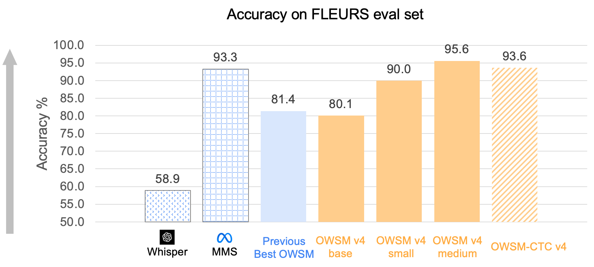
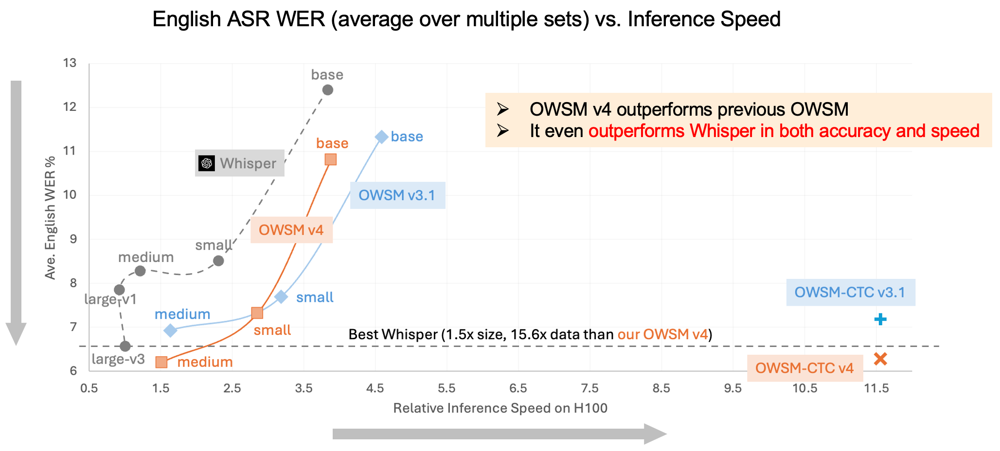
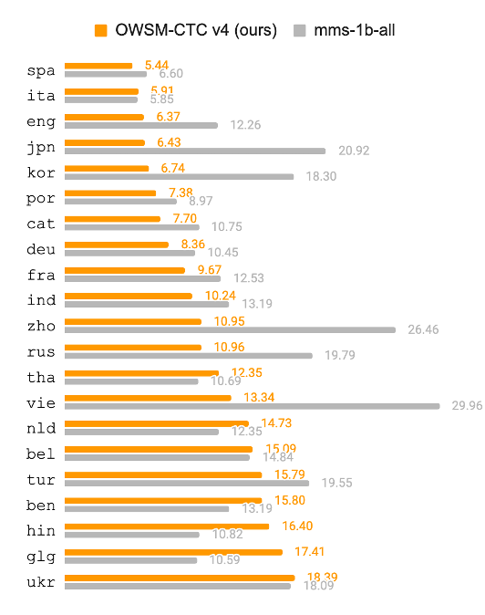

# OWSM v4

The [Open Whisper-style Speech Model (OWSM)](https://www.wavlab.org/activities/2024/owsm/) project develops fully open speech foundation models using publicly available data and open-source toolkits.

OWSM v4 significantly outperforms previous versions in multilingual tasks. It is trained on a [clean version of YODAS](https://huggingface.co/datasets/espnet/yodas_owsmv4) along with previous OWSM data. Please refer to our paper for more details about the training process: https://arxiv.org/abs/2506.00338

Note: OWSM v4 applies 8 times subsampling (instead of 4 times in OWSM v3.1) to the log Mel features, leading to a final resolution of 80 ms in the encoder.
When running inference, we recommend setting `maxlenratio=1.0` (default) instead of smaller values.

## Results

Please refer to our paper for comprehensive evaluations. Below are some notable results.

### Language Identification




### English ASR



### Multilingual ASR




## Data Cleaning

As presented in Section 2.1 of [our paper](https://arxiv.org/abs/2506.00338), we conducted three-stage data cleaning from the original [YODAS2](https://huggingface.co/datasets/espnet/yodas2) dataset.
- Resegmentation (Section 2.1.1 in the paper)
- LID-based filtering (Section 2.1.2)
- CTC-score-based filtering (Section 2.1.3)

To get started, download the YODAS2 dataset to a local directory and create a text file containing paths to all data files that need to be processed. For example, we create `data_reseg/json_files.txt`:
```
/work/hdd/bbjs/shared/corpora/yodas2/data/af000/text/00000000.json
/work/hdd/bbjs/shared/corpora/yodas2/data/af000/text/00000001.json
/work/hdd/bbjs/shared/corpora/yodas2/data/am000/text/00000000.json
/work/hdd/bbjs/shared/corpora/yodas2/data/am000/text/00000001.json
...
```

Then, pass the file list to `local/data.sh` which will filter the data and convert the processed version in Kaldi style for later training.

### Stage 1: Resegmentation

YODAS provides unsegmented long-form recordings, each of them is accompanied by a list of text transcriptions annotated with start and end timestamps. However, these timestamps can be inaccurate. Consequently, our first step is to realign the audio and text using the CTC segmentation algorithm.

We first launch parallel jobs for CTC segmentation in `local/ctc_seg.py`, and then resegment the short utterances into long-form utterances up to 30 seconds in `local/get_longform_from_reseg.py`. This makes the training data consistent with the Whisper-style training.

### Stage 2: LID-based filtering

We observe that certain utterances have incorrect language labels. To address this issue, we perform language identification on both audio and text using public models using `local/lid.py`. Then, we remove utterances where the language label does not match the identified language from either audio or text, as implemented in `local/filter_lid.py`.

### Stage 3: CTC-score-based filtering

The CTC segmentation algorithm assigns a score to each utterance, which indicates the confidence of the segmentation. We filter out utterances with low CTC scores using `local/filter_score.py`. The CTC confidence score is language-dependent; therefore, we rank the scores of short utterances within each language and select a relative threshold (quantile).

Finally, we convert the filtered data into Kaldi format using `local/convert_to_kaldi.py`. The resulting data is stored in `data`.

## OWSM series

### Encoder-decoder OWSM

| Name | Size | Hugging Face Repo |
| :--- | ---: | :---------------- |
| OWSM v3.1 base | 101M | https://huggingface.co/espnet/owsm_v3.1_ebf_base |
| OWSM v3.1 small | 367M | https://huggingface.co/espnet/owsm_v3.1_ebf_small |
| OWSM v3.1 medium | 1.02B | https://huggingface.co/espnet/owsm_v3.1_ebf |
| OWSM v3.2 small | 367M | https://huggingface.co/espnet/owsm_v3.2 |
| OWSM v4 base | 102M | https://huggingface.co/espnet/owsm_v4_base_102M |
| OWSM v4 small | 370M | https://huggingface.co/espnet/owsm_v4_small_370M |
| OWSM v4 medium | 1.02B | https://huggingface.co/espnet/owsm_v4_medium_1B |


### CTC-based OWSM

| Name | Size | Hugging Face Repo |
| :--- | ---: | :---------------- |
| OWSM-CTC v3.1 medium | 1.01B | https://huggingface.co/espnet/owsm_ctc_v3.1_1B |
| OWSM-CTC v3.2 medium | 1.01B | https://huggingface.co/espnet/owsm_ctc_v3.2_ft_1B |
| OWSM-CTC v4 medium | 1.01B | https://huggingface.co/espnet/owsm_ctc_v4_1B |


### Citations

#### OWSM v4

```BibTex
@inproceedings{owsm-v4,
  title={{OWSM} v4: Improving Open Whisper-Style Speech Models via Data Scaling and Cleaning},
  author={Yifan Peng and Shakeel Muhammad and Yui Sudo and William Chen and Jinchuan Tian and Chyi-Jiunn Lin and Shinji Watanabe},
  booktitle={Proceedings of the Annual Conference of the International Speech Communication Association (INTERSPEECH)},
  year={2025},
}
```

#### OWSM-CTC

```BibTex
@inproceedings{owsm-ctc,
    title = "{OWSM}-{CTC}: An Open Encoder-Only Speech Foundation Model for Speech Recognition, Translation, and Language Identification",
    author = "Peng, Yifan  and
      Sudo, Yui  and
      Shakeel, Muhammad  and
      Watanabe, Shinji",
    booktitle = "Proceedings of the Annual Meeting of the Association for Computational Linguistics (ACL)",
    year = "2024",
    month= {8},
    url = "https://aclanthology.org/2024.acl-long.549",
}
```

#### OWSM v3.1 and v3.2

```BibTex
@inproceedings{owsm-v32,
  title={On the Effects of Heterogeneous Data Sources on Speech-to-Text Foundation Models},
  author={Jinchuan Tian and Yifan Peng and William Chen and Kwanghee Choi and Karen Livescu and Shinji Watanabe},
  booktitle={Proceedings of the Annual Conference of the International Speech Communication Association (INTERSPEECH)},
  year={2024},
  month={9},
  pdf="https://arxiv.org/pdf/2406.09282"
}
@inproceedings{owsm-v31,
  title={{OWSM v3.1: Better and Faster Open Whisper-Style Speech Models based on E-Branchformer}},
  author={Yifan Peng and Jinchuan Tian and William Chen and Siddhant Arora and Brian Yan and Yui Sudo and Muhammad Shakeel and Kwanghee Choi and Jiatong Shi and Xuankai Chang and Jee-weon Jung and Shinji Watanabe},
  booktitle={Proceedings of the Annual Conference of the International Speech Communication Association (INTERSPEECH)},
  year={2024},
  month={9},
  pdf="https://arxiv.org/pdf/2401.16658",
}
```

#### Initial OWSM (v1, v2, v3)

```BibTex
@inproceedings{owsm,
  title={Reproducing Whisper-Style Training Using An Open-Source Toolkit And Publicly Available Data},
  author={Yifan Peng and Jinchuan Tian and Brian Yan and Dan Berrebbi and Xuankai Chang and Xinjian Li and Jiatong Shi and Siddhant Arora and William Chen and Roshan Sharma and Wangyou Zhang and Yui Sudo and Muhammad Shakeel and Jee-weon Jung and Soumi Maiti and Shinji Watanabe},
  booktitle={Proceedings of the IEEE Automatic Speech Recognition and Understanding Workshop (ASRU)},
  year={2023},
  month={12},
  pdf="https://arxiv.org/pdf/2309.13876",
}
```
