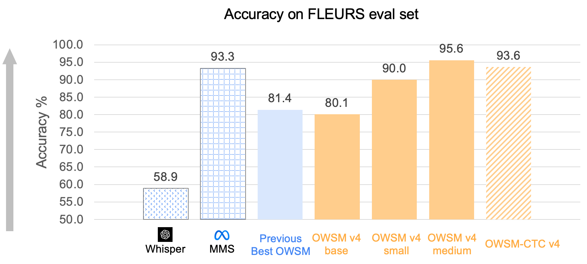
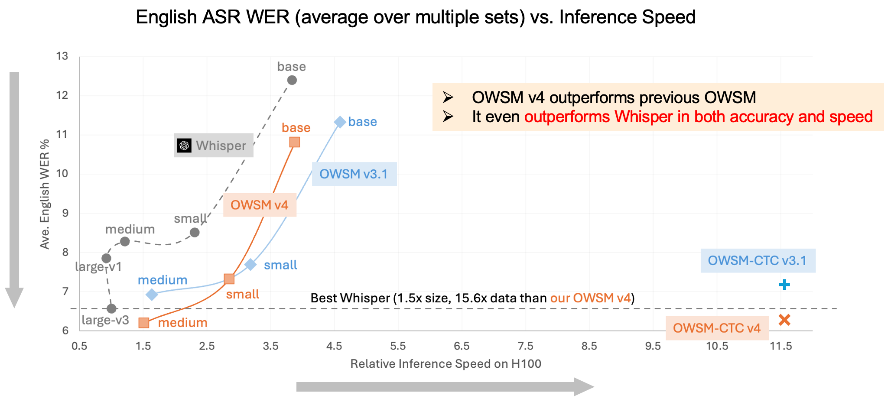
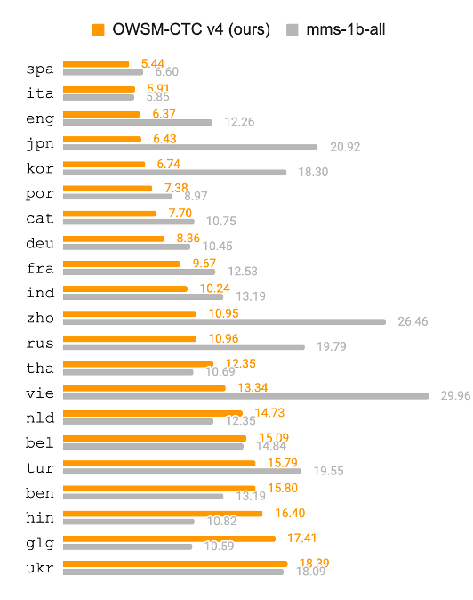

# OWSM v4

The [Open Whisper-style Speech Model (OWSM)](https://www.wavlab.org/activities/2024/owsm/) project develops fully open speech foundation models using publicly available data and open-source toolkits.

OWSM v4 significantly outperforms previous versions in multilingual tasks. It is trained on a [clean version of YODAS](https://huggingface.co/datasets/espnet/yodas_owsmv4) along with previous OWSM data. Please refer to our paper for more details about the training process: https://arxiv.org/abs/2506.00338

Note: OWSM v4 applies 8 times subsampling (instead of 4 times in OWSM v3.1) to the log Mel features, leading to a final resolution of 80 ms in the encoder.
When running inference, we recommend setting `maxlenratio=1.0` (default) instead of smaller values.

## Results

Please refer to our paper for comprehensive evaluations. Below are some notable results.

### Language Identification




### English ASR



### Multilingual ASR




## Data Cleaning

As presented in Section 2.1 of [our paper](https://arxiv.org/abs/2506.00338), we conducted three-stage data cleaning from the original [YODAS2](https://huggingface.co/datasets/espnet/yodas2) dataset.
- Resegmentation (Section 2.1.1 in the paper)
- LID-based filtering (Section 2.1.2)
- CTC-score-based filtering (Section 2.1.3)

To get started, download the YODAS2 dataset to a local directory and create a text file containing paths to all data files that need to be processed. For example, we create `data_reseg/json_files.txt`:
```
/work/hdd/bbjs/shared/corpora/yodas2/data/af000/text/00000000.json
/work/hdd/bbjs/shared/corpora/yodas2/data/af000/text/00000001.json
/work/hdd/bbjs/shared/corpora/yodas2/data/am000/text/00000000.json
/work/hdd/bbjs/shared/corpora/yodas2/data/am000/text/00000001.json
...
```

Then, pass the file list to `local/data.sh` which will filter the data and convert the processed version in Kaldi style for later training.

### Stage 1: Resegmentation

YODAS provides unsegmented long-form recordings, each of them is accompanied by a list of text transcriptions annotated with start and end timestamps. However, these timestamps can be inaccurate. Consequently, our first step is to realign the audio and text using the CTC segmentation algorithm.

We first launch parallel jobs for CTC segmentation in `local/ctc_seg.py`, and then resegment the short utterances into long-form utterances up to 30 seconds in `local/get_longform_from_reseg.py`. This makes the training data consistent with the Whisper-style training.

### Stage 2: LID-based filtering

We observe that certain utterances have incorrect language labels. To address this issue, we perform language identification on both audio and text using public models using `local/lid.py`. Then, we remove utterances where the language label does not match the identified language from either audio or text, as implemented in `local/filter_lid.py`.

### Stage 3: CTC-score-based filtering

The CTC segmentation algorithm assigns a score to each utterance, which indicates the confidence of the segmentation. We filter out utterances with low CTC scores using `local/filter_score.py`. The CTC confidence score is language-dependent; therefore, we rank the scores of short utterances within each language and select a relative threshold (quantile).

Finally, we convert the filtered data into Kaldi format using `local/convert_to_kaldi.py`. The resulting data is stored in `data`.

## Open ASR Leaderboard samples and CPU decoding speed

`local/run_hf_asr_leaderboard.sh` samples about 100 utterances from several test sets of the [Open ASR Leaderboard](https://huggingface.co/datasets/hf-audio/open-asr-leaderboard) and measures the WER and RTFx of an OWSM checkpoint on them, so that a change to the inference code can be checked on a laptop in a few minutes. WER is computed as on the leaderboard (Whisper English text normalizer, corpus-level WER with jiwer). RTFx is the total audio duration divided by the decoding time; model loading and one warm-up batch are not counted.

The dataset is gated: accept the terms on its page and log in with `huggingface-cli login` (or set `HF_TOKEN`). `jiwer` and `openai-whisper` are needed for the scoring.

```bash
# six sets, 100 utterances each, OWSM v4 base, batch 8 sorted by length
local/run_hf_asr_leaderboard.sh --model_tag espnet/owsm_v4_base_102M --batch_size 8 --sort true

# one set, one configuration
python local/prepare_hf_asr_leaderboard.py --dataset librispeech --split test.clean --n 100 --out data/lb_librispeech_test_clean
python local/eval_hf_asr_leaderboard.py --data data/lb_librispeech_test_clean --model_tag espnet/owsm_v4_base_102M \
    --batch_size 8 --sort true --out exp/hf_asr_leaderboard/test_clean.json
```

The Hub copies of the test sets are sorted by length, longest first, so the first N rows would be the N longest utterances; the script takes a seeded shuffle instead and skips utterances longer than 30 s, the fixed input length of OWSM. The samples are written as Kaldi-style data directories (`wav.scp`, `text`, `utt2dur`, ...) under `data/lb_*`, so they can also be decoded with the usual recipe stages. `info.json` in each directory records how the sample was drawn.

### Results on CPU

Apple M4 laptop, 4 threads, PyTorch 2.12 (CPU), `ctc_weight=0`, beam 5 unless noted, decoding time only. 100 utterances per set, drawn with seed 0 (`info.json` has the details); the samples are small, so the WER columns compare decoding configurations on the same utterances rather than the models on the full test sets.

| set | utterances | audio (min) | mean length (s) |
| --- | ---: | ---: | ---: |
| test-clean | 100 | 13.8 | 8.3 |
| test-other | 100 | 11.8 | 7.1 |
| AMI | 100 | 8.2 | 4.9 |
| VoxPopuli | 100 | 18.6 | 11.2 |
| Earnings-22 | 100 | 13.1 | 7.8 |
| Common Voice | 100 | 12.4 | 7.5 |

| decoding (WER % / RTFx) | test-clean | test-other | AMI | VoxPopuli | Earnings-22 | Common Voice |
| --- | ---: | ---: | ---: | ---: | ---: | ---: |
| beam 5, batch 1, maxlenratio 1.0 (old README advice) | 3.35 / 0.9 | - | - | - | - | - |
| beam 5, batch 1, maxlenratio 0 (default) | 3.35 / 8.8 | 9.31 / 8.2 | 16.77 / 6.2 | 5.37 / 9.4 | 16.61 / 9.9 | 19.39 / 10.9 |
| beam 5, batch 8 sorted, maxlenratio 0 | 3.35 / 9.8 | 9.31 / 9.3 | 16.77 / 7.1 | 5.37 / 7.8 | 16.61 / 9.9 | 19.39 / 12.2 |
| greedy, batch 8 sorted, maxlenratio 0 | 3.57 / 23.1 | 9.78 / 17.5 | 29.63 / 11.6 | 5.69 / 32.7 | 16.50 / 24.4 | 20.81 / 26.0 |
| 370M: beam 5, batch 8 sorted, maxlenratio 0 | 2.32 / 2.7 | 6.31 / 2.2 | 12.65 / 0.6 | 3.96 / 3.5 | 14.03 / 2.9 | 15.15 / 2.3 |

What the rows mean:

- OWSM v4 pads every input to 30 s, so the maximum output length is 374 steps whatever the utterance. With `maxlenratio=1.0` the beam search always runs to that maximum: once the real transcript has ended, the remaining beams keep producing punctuation and fragments over the padded silence, and about 97% of the decoding time goes there.
- With `maxlenratio=0` (the default) the maximum length is the same, but the beam search also runs its end detection (Eq. 50 of Watanabe et al., 2017) and stops once the recently finished hypotheses are all far below the best one. The transcripts are identical to the `1.0` run on all 100 utterances of every set above.
- `--batch_size 8 --sort true` decodes eight utterances of similar length in one beam search (`Speech2Text.batch_decode`). Also identical transcripts. A batch runs until end detection has fired for its slowest utterance, so on this CPU sorted batches gain between nothing and 25% over batch 1 and lose on VoxPopuli; unsorted batches are slower still.
- The 370M model on AMI shows the limit of end detection: on some of these short, noisy utterances no hypothesis ends at three consecutive lengths, so 4 of the 13 sorted batches ran to the 374-step maximum (about 200 s each) and the set decodes at 9 s per utterance while the other sets take about 3 s.
- Greedy decoding (`--beam_size 1`) is faster still but not safe: on AMI it falls into repetition loops on some utterances and the WER almost doubles.
- Also tried and not worth it on this machine: encoding the true utterance length instead of 30 s (WER 3.35 -> 10.2, the model needs the padded context), padding to 10 to 20 s buckets or to speech plus a short tail (WER +0.1 to +1.2 for at most 1.3x), bfloat16 (30x slower on the CPU), int8 dynamic quantization (WER +1.8 and slower), 8 or 10 threads instead of 4, and SDPA in the decoder (no change).

## OWSM series

### Encoder-decoder OWSM

| Name | Size | Hugging Face Repo |
| :--- | ---: | :---------------- |
| OWSM v3.1 base | 101M | https://huggingface.co/espnet/owsm_v3.1_ebf_base |
| OWSM v3.1 small | 367M | https://huggingface.co/espnet/owsm_v3.1_ebf_small |
| OWSM v3.1 medium | 1.02B | https://huggingface.co/espnet/owsm_v3.1_ebf |
| OWSM v3.2 small | 367M | https://huggingface.co/espnet/owsm_v3.2 |
| OWSM v4 base | 102M | https://huggingface.co/espnet/owsm_v4_base_102M |
| OWSM v4 small | 370M | https://huggingface.co/espnet/owsm_v4_small_370M |
| OWSM v4 medium | 1.02B | https://huggingface.co/espnet/owsm_v4_medium_1B |


### CTC-based OWSM

| Name | Size | Hugging Face Repo |
| :--- | ---: | :---------------- |
| OWSM-CTC v3.1 medium | 1.01B | https://huggingface.co/espnet/owsm_ctc_v3.1_1B |
| OWSM-CTC v3.2 medium | 1.01B | https://huggingface.co/espnet/owsm_ctc_v3.2_ft_1B |
| OWSM-CTC v4 medium | 1.01B | https://huggingface.co/espnet/owsm_ctc_v4_1B |


### Citations

#### OWSM v4

```BibTex
@inproceedings{owsm-v4,
  title={{OWSM} v4: Improving Open Whisper-Style Speech Models via Data Scaling and Cleaning},
  author={Yifan Peng and Shakeel Muhammad and Yui Sudo and William Chen and Jinchuan Tian and Chyi-Jiunn Lin and Shinji Watanabe},
  booktitle={Proceedings of the Annual Conference of the International Speech Communication Association (INTERSPEECH)},
  year={2025},
}
```

#### OWSM-CTC

```BibTex
@inproceedings{owsm-ctc,
    title = "{OWSM}-{CTC}: An Open Encoder-Only Speech Foundation Model for Speech Recognition, Translation, and Language Identification",
    author = "Peng, Yifan  and
      Sudo, Yui  and
      Shakeel, Muhammad  and
      Watanabe, Shinji",
    booktitle = "Proceedings of the Annual Meeting of the Association for Computational Linguistics (ACL)",
    year = "2024",
    month= {8},
    url = "https://aclanthology.org/2024.acl-long.549",
}
```

#### OWSM v3.1 and v3.2

```BibTex
@inproceedings{owsm-v32,
  title={On the Effects of Heterogeneous Data Sources on Speech-to-Text Foundation Models},
  author={Jinchuan Tian and Yifan Peng and William Chen and Kwanghee Choi and Karen Livescu and Shinji Watanabe},
  booktitle={Proceedings of the Annual Conference of the International Speech Communication Association (INTERSPEECH)},
  year={2024},
  month={9},
  pdf="https://arxiv.org/pdf/2406.09282"
}
@inproceedings{owsm-v31,
  title={{OWSM v3.1: Better and Faster Open Whisper-Style Speech Models based on E-Branchformer}},
  author={Yifan Peng and Jinchuan Tian and William Chen and Siddhant Arora and Brian Yan and Yui Sudo and Muhammad Shakeel and Kwanghee Choi and Jiatong Shi and Xuankai Chang and Jee-weon Jung and Shinji Watanabe},
  booktitle={Proceedings of the Annual Conference of the International Speech Communication Association (INTERSPEECH)},
  year={2024},
  month={9},
  pdf="https://arxiv.org/pdf/2401.16658",
}
```

#### Initial OWSM (v1, v2, v3)

```BibTex
@inproceedings{owsm,
  title={Reproducing Whisper-Style Training Using An Open-Source Toolkit And Publicly Available Data},
  author={Yifan Peng and Jinchuan Tian and Brian Yan and Dan Berrebbi and Xuankai Chang and Xinjian Li and Jiatong Shi and Siddhant Arora and William Chen and Roshan Sharma and Wangyou Zhang and Yui Sudo and Muhammad Shakeel and Jee-weon Jung and Soumi Maiti and Shinji Watanabe},
  booktitle={Proceedings of the IEEE Automatic Speech Recognition and Understanding Workshop (ASRU)},
  year={2023},
  month={12},
  pdf="https://arxiv.org/pdf/2309.13876",
}
```
