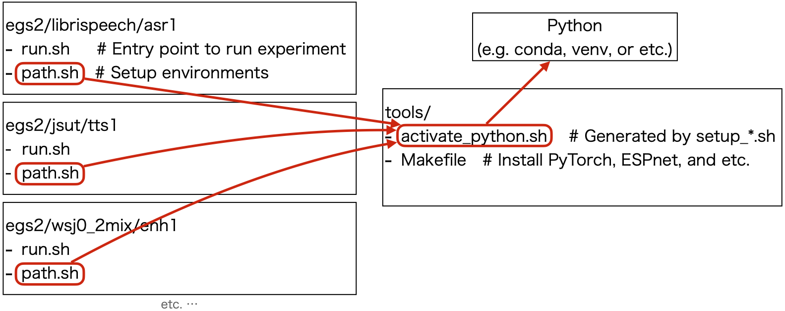

# Tools for setup

<div align="left"></div>


See also https://espnet.github.io/espnet/installation.html

## Contents
```
installers/        # Instllation scripts for extra tools
Makefile           # Makefile to make an environment for experiments in espnet
check_install.py   # To check the status of installation
extra_path.sh      # Setup script for environment variables for extra tools
setup_cuda_env.sh  # Setup script for environment variables for cuda
setup_anaconda.sh  # To generate activate_python.sh with conda environment
setup_python.sh    # To generate activate_python.sh with the specified python
setup_venv.sh      # To generate activate_python.sh with venv of your python
```

## Install

```sh
# ./setup_anaconda.sh <conda-root|default="venv"> <env-name|default=root env> <python-version|default=latest python>
# e.g.
./setup_anaconda.sh miniconda espnet
# If the conda-root already exists at the path, it tries to create in the conda
# ./setup_anaconda.sh /some/where/miniconda espnet

# make TH_VERSION=<torch-ver|default=latest torch>
# e.g.
make
```

For more detail: https://espnet.github.io/espnet/installation.html#step-2-installation-espnet

## Check installation

```sh
bash -c ". ./activate_python.sh; . ./extra_path.sh; python3 check_install.py"
```
